# 집에서 국수역까지

(크롭하는 바람에 저작권이 잘리는데 앞으로 등장하는 모든 지도는 네이버 캡춰입니다.)

자전거 산 첫날은 서쪽으로 가봤으니, 이틀이 지난 이날은 동쪽으로 가봐야지 싶었다.
친구가 가보라는 남양주 호평동 정도까지. 성수사거리 집에서 30 킬로가 채 못 되었다.
구입 첫날 무리한 라이딩으로 회음부 통증은 여전했지만 안장을 바꾸어서 올라타고 있을 지경은 되었다. 

[https://vine.co/v/hnL7MOpiDu7](https://vine.co/v/hnL7MOpiDu7)

워커힐 부근 지나면서 찍은 코스모스. 익숙하지 않아 핸들이 마구 흔들린다.

앞으로 Vine 동영상을 가끔 링크걸 것인데 안 나오는 경우는 창을 닫고 몇 번 다시 클릭해 본다.

워커힐 지날 때만 해도 그냥 집근처 한강 고수부지를 달린다는 개념이었다.
가끔 '4대강 자전거길'이라느니 '국토종주'니 하는 표지판이 지나갔는데 보일 때마다 MB 욕이나 하는 수준이었다.
'누가 자전거를 타고 저런 걸 한담?'

남양주시 지나는 부근에 언덕이 하나 있다. 내 자전거 생에 최초의 고비였달까;
내 브롬톤은 6 단이야하면서 기어를 밖으로 다 밀었다. 열심히 밟았는데 '어, 이게 아닌데' 하는 느낌이 왔다.
나중에 알고보니 다른 바퀴 큰 자전거들은 20 단, 30 단 이렇더라. 그런 것이었다.

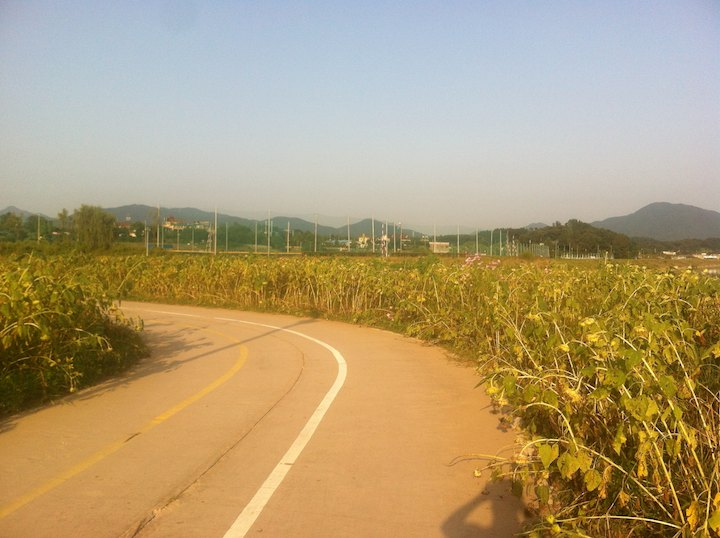

언덕을 넘자 해바라기 밭이 나온다.

[https://vine.co/v/hnlBHDdw0AL](https://vine.co/v/hnlBHDdw0AL)

덕소역 근방 다리들도 보고. 역시나 불안불안;

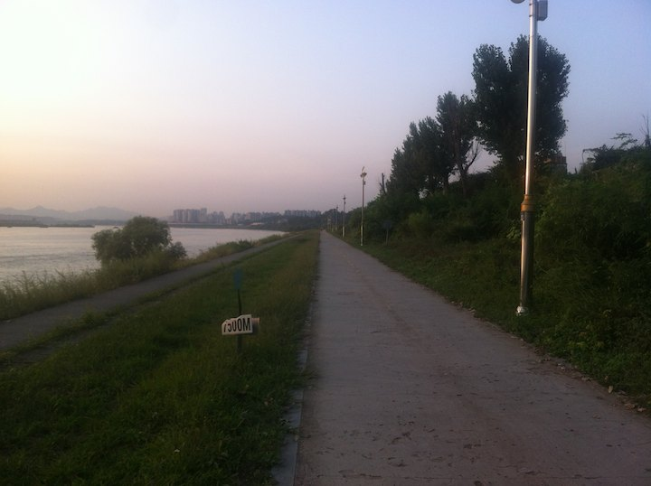

뒤돌아서 서울쪽을 바라봤다.
원래 목적지였단 호평동은 진작에 지나쳤다.

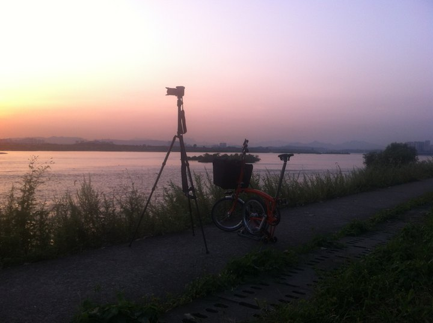

가끔 바구니에서 카메라와 삼각대를 꺼내 이렇게 사진을 찍는다.
누보 스탠드를 장착하기 전이라 브롬톤을 세우려면 뒷바퀴를 접어야 했다.

[https://vine.co/v/hnlqDgO9HjD](https://vine.co/v/hnlqDgO9HjD)

물소리도 녹음하고.

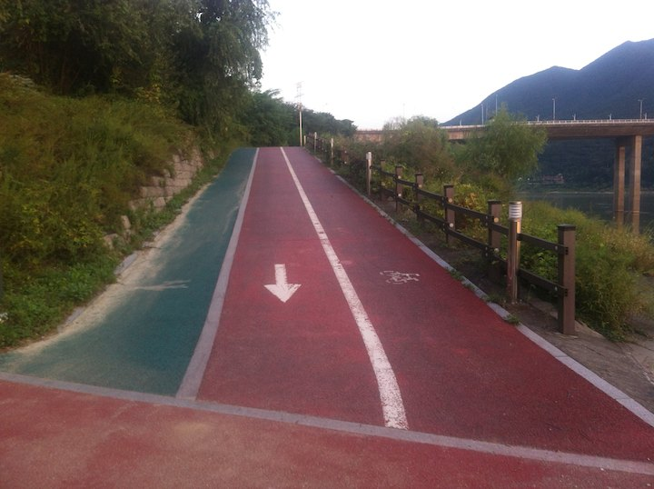

첨엔 이런데도 넘기 힘들었다.

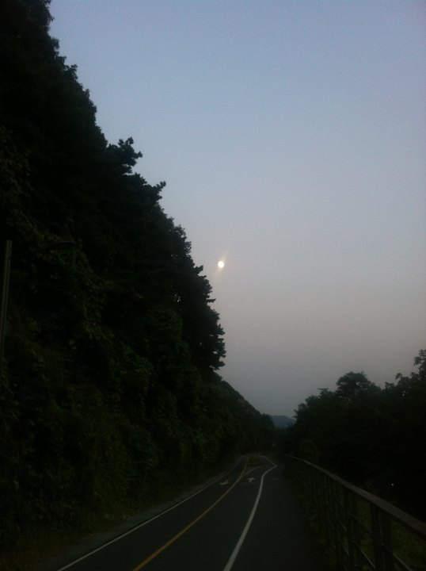

해가 넘어갔다. 헤드라이트를 켰는데, 어라, 불이 안 들어온다.
헤드라이트 뚜껑이 베터리 한쪽과 함께 사라져있다.

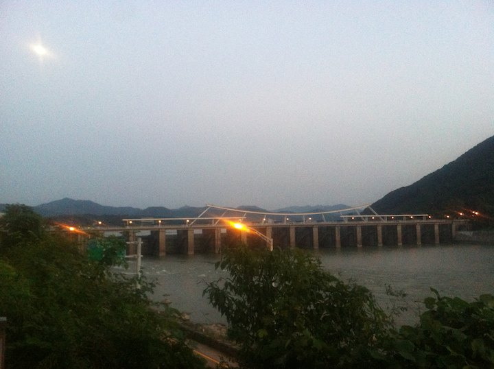

팔당댐.

[https://vine.co/v/hnlDmm0IAHK](https://vine.co/v/hnlDmm0IAHK)

팔당댐옆 자전거 터널. 세상에 자전거 전용 터널이라니. 생각지도 못했다.

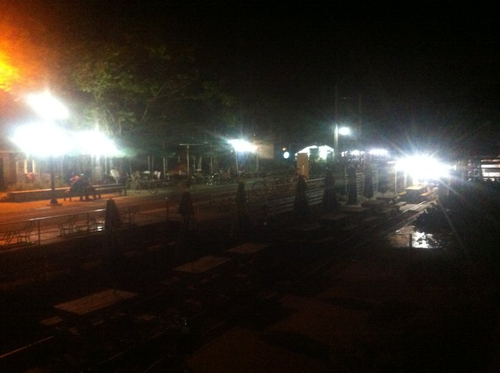

해진 길을 한시간 쯤 달리니 능내 유원지가 나온다.
팔당부근부터 이곳까지는 옛 철길을 유원지로 만들어서 독특한 느낌을 준다.
모든 블로거들이 여기 사진을 찍는다;

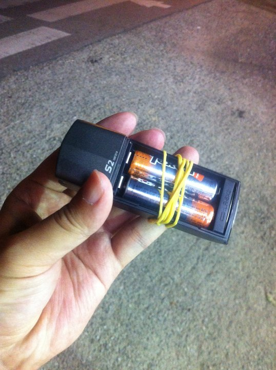

헤드라이트에 응급처치. 계속 갈 수 있게 되었다.

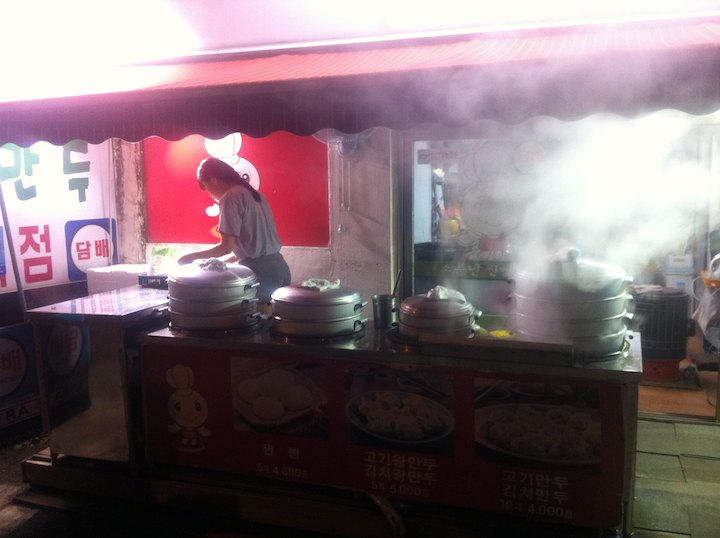

만두로 배를 채우고,

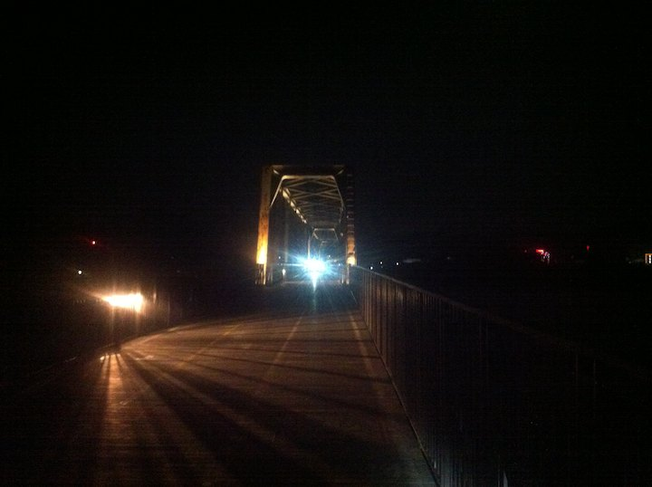

자전거 전용 터널 뿐만이 아니었다.
양수철교 옆에는 자전거 전용 다리도 있다.
이 다리로 북한강을 넘어 남한강 쪽으로 가는데 이름도 없는 다리가 엄청 고급스럽다.
여기서 부터 MB 의 돈 씀씀이가 느껴진다.

다리를 넘은 것이 밤 8 시쯤인데 이 때부터 두 시간 넘게 사진을 찍지 못했다.
입이 벌어져서; 
자전거 전용 터널 5 개쯤 지날 때부터는 턱이 떨어졌다. 엉덩이 통증도 무감각해졌다.
'MB, 당신의 돈 씀씀이에 제가 졌습니다.'

중앙선 운길산역 부근부터 시작되는 이 남한강 자전거 고속도로는 꼭 타보시길 권한다.
양평역까지 가서 중앙선으로 되돌아올 수 있다.

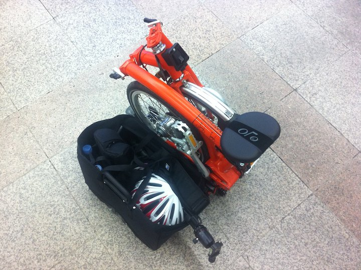

이날 성수사거리 집에서 중앙선 국수역까지 7 시간 동안 44 킬로 달렸다.
전철 시간 때문에 멈추었지만 마음은 계속 달리고 있었다.
