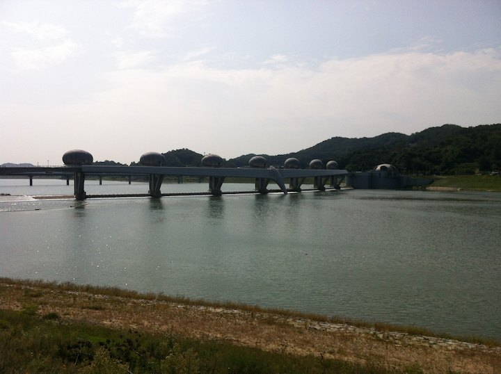
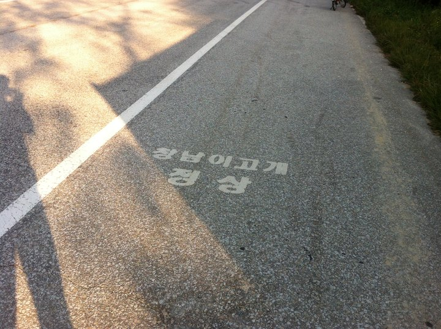

# 국수역에서 부론면까지

말도 못하게 아름답다. 거대한 유원지 지나는 느낌. 터널 냉장고 코스. 할머니하고 레이싱. 메뚜기 피하기. 굽이굽이 돌네마다 코스 이벤트 있다. 아직 서울과 가까워서 집들, 카페들, 꽃길 많다.

이포보 부근부터는 사막. 도로와 말라죽은 가로수 밖에 없다.

내 현재 속도는... 잘 모르겠고, 옆에 날던 잠자리가 앉아서 쉬었다가는 정도.

MB 윈. ㅂㄱㅎ 가 아무리 옷을 많이 사도 겨룰 수가 없을 듯. MB 의 씀씀이를 견딜 수가 없었음. ㅋㅋ. 여러 가지 의미로 눈물 남. 

전에 국수역까지 해서 오늘은 국수에서 부론면까지 62 킬로 했네요. 자전거도 느린 데다가 자주 내려 사진까지 찍어서 하루 100 킬로도 힘든듯.

남한강 입구부터는 MB 가 자전거 터널을 뚫고 + 자전거 다리를 놔서 거의 핸들 꺾을 필요도 없다; 대관령 고속도로의 자전거 판이라고 보면 된다; 달리며 가카를 느낄 수 있다;

