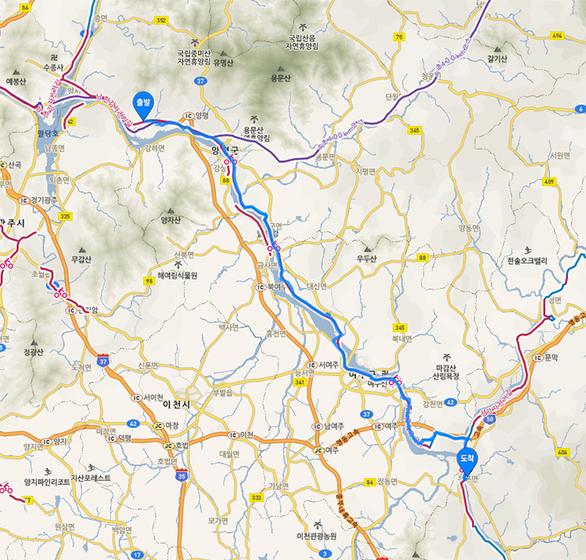
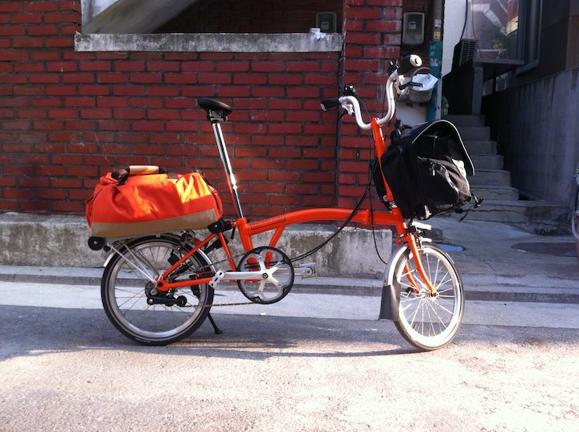
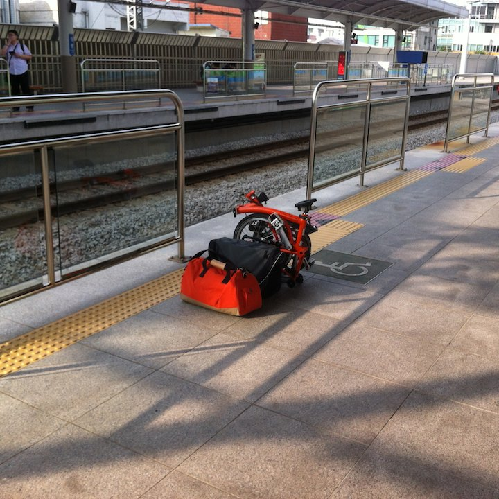
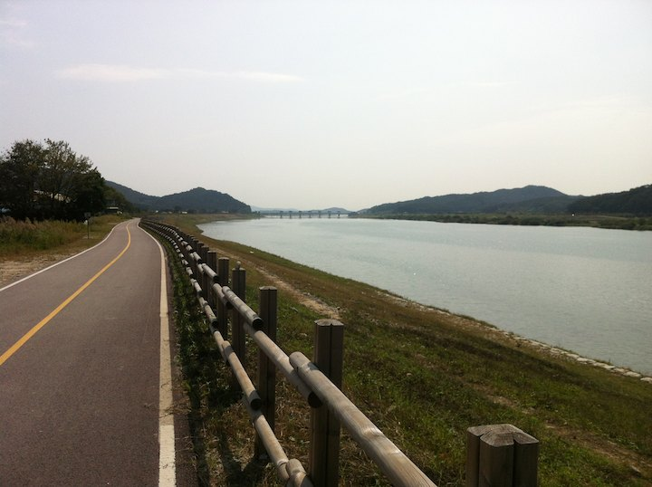
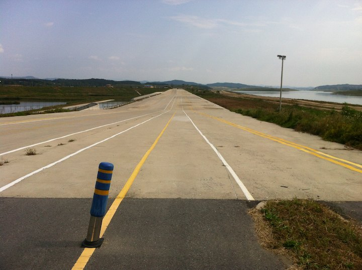
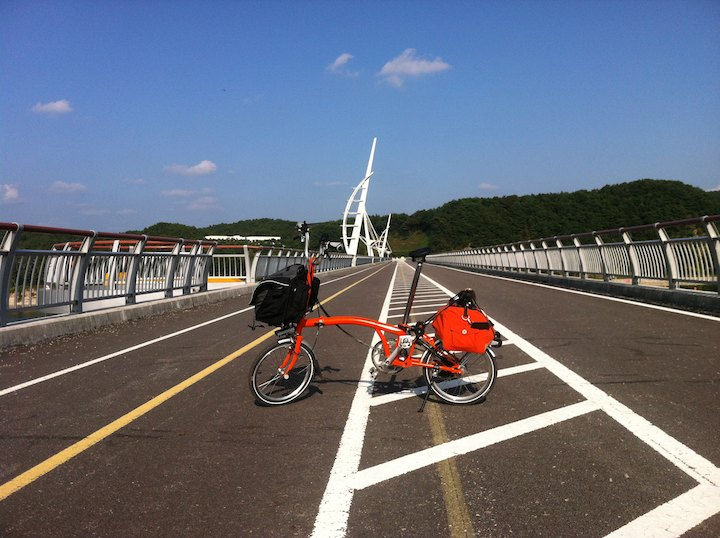
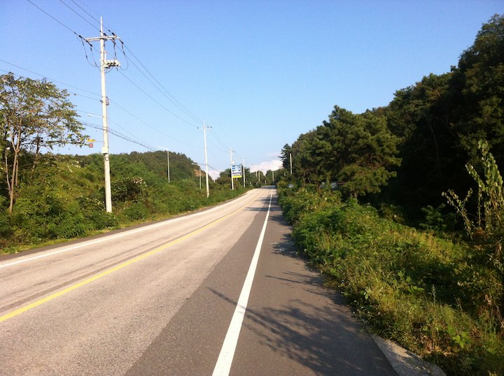
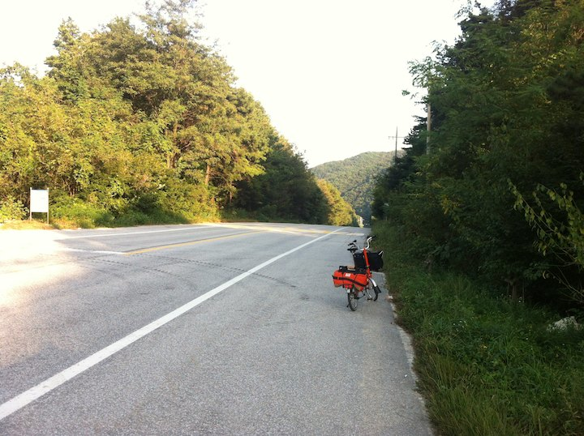
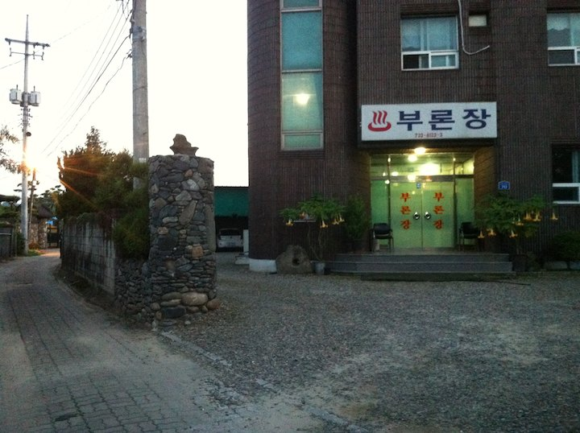
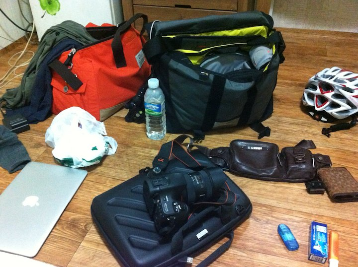

# 국수역에서 부론면까지

첫날 계획은 며칠전 달렸던 국수까지 전철로 이동후 충주까지 100 킬로 라이딩하는 것이었다. 계획은 그랬다;
실제 진도는 부론면까지 나갔는데 앞으로 '도착'하였다는 말은 그 지역에 모텔이 있다는 의미니 참고하시면 좋겠다.

떠나기 전 집앞에서 찰칵. 2005 년 마지막 여행한 후 8 년만이다.
일정도 목적지도 말 못하고 떠난다.
가다가 지쳐 내일 돌아올지, 내일 모래 돌아올지 모를 일이다.
가다가 자전거가 고장날 지, 내 몸이 고장날지도 모를 일이다.
그냥 갈 수 있는 데까지 갔다가 오자. 편하게.
이렇게 자전거 사고 일주일만에 무식하면 용함한 국토종주가 시작되었다;

상봉역에서 국수역 가는 중앙선을 기다리는 중.
브롬톤은 접을 수 있어서 대중교통 사용에 제약이 없지만
일반 자전거는 지하철 노선별 허용여부가 모두 달라서 미리 확인해야 한다.
중앙선은 출퇴근 시간을 제외하고는 항상 가능. 아예 자전거를 대량 실을 수 있는 객차가 있다.

국수역에 도착하여 남한강 라이딩 시작. 두 시간여 사진이 없다.
말도 못하게 재밋고 아름다워서 사진 찍을 생각도 못했다; 다 찍을 수도 없었다.
거대한 유원지다. 지나는 동네마다 주변이 다양해 코스 요리를 구경하는 기분이다. 
서울과 가까워서 카페들, 꽃길이 많다.
농가들도 모두 근사하게 지어져있다.
구경거리가 끝이 없다.

양수리부터 양평역까지는 MB 가 자전거 터널을 뚫고 자전거 다리를 놔서 거의 핸들 꺾을 필요도 없다.
그냥 가카를 느끼며 달리면 된다.

브롬톤은 느리고, 짐을 앞 뒤로 실어서 더 느리지만, 할머니 자전거와 레이싱하는 것도 재밋고, 옆에 날던 잠자리가 앉아서 쉬었다가는 것도 좋다. 느린 것은 문제되지 않는다. 이때까지는;

멀리 이포보가 보인다.
이포보 바로 전에 꽤 하는 언덕이 있다. 나중에 알았지만 낙동강 언덕들에 비하면 줄넘기 수준이었다.
이포보 부근부터는 이뿐 풍경이 사라지고 사막이 시작된다.
섬강부근 가기 전까지 오후 내내 도로와 말라죽은 가로수 밖에 못 봤다.

중간에 이런 풍경이 있긴했다. 군사시설인 듯 하다.

여주시 자전거 길이 좋지 않다. 엉덩 아프다. 날씨가 뜨겁다.

강천보 넘으며 한장.
날씨도 뜨겁고 평일이라 사람이 없다.

강천리부터 자전거 전용도로가 끝나고 국도가 시작된다.
나중에 깨달았지만 국도가 시작된다는 말은 거의 언덕이 있다는 말이다.
이포보 전에 국도는 차가 안 다녔는데 이 창남이 고개는 차까지 쌩쌩 달린다.
처음 타보는 국도라 좀 후달렸다. 브롬톤을 꽉 부여잡고 한참을 끌바;

고개 정상에서 숨좀 돌리고;

벌써 5 시다. 충주에 도착은 커녕, 오늘 묵을 곳도 찾지 못했다;

창남이고개 국도가 끝나면 섬강 자전거 길로 내려가 아주 잠시 달릴 수 있는데 진짜 아름답다.
다음에 섬강을 쭉 올라가야 겠다는 다짐을. 
근데 난 왜 여기 사진을 안 찍어 놨나;

섬강 하구를 나와 다시 남한강을 좀 타다보면 부론면이 나온다.
여기에 뜬금없이 여관 하나가 있다. 
막 해떨어지는 시간, 부론면이 날 살렸다;

대구 전까지 여관비는 거의 3.5 만이다. 비싸다; 대구부터는 평일 2 ~ 2.5 만원이다.

반바지에 나시를 입고 탔더니 오후 햇볓에 몸이 통구이가됐다;
아, 무식하게도 해를 가려야한다는 개념이 없었다;
체크인 하고 널부려졌다.

국수역에서 부론면까지 9 시간 62 킬로 했다.
자전거도 느린 데다가 자주 내려 사진까지 찍어서 하루 100 킬로는 무리다.

첫날 여행을 무사히 마쳤다.
