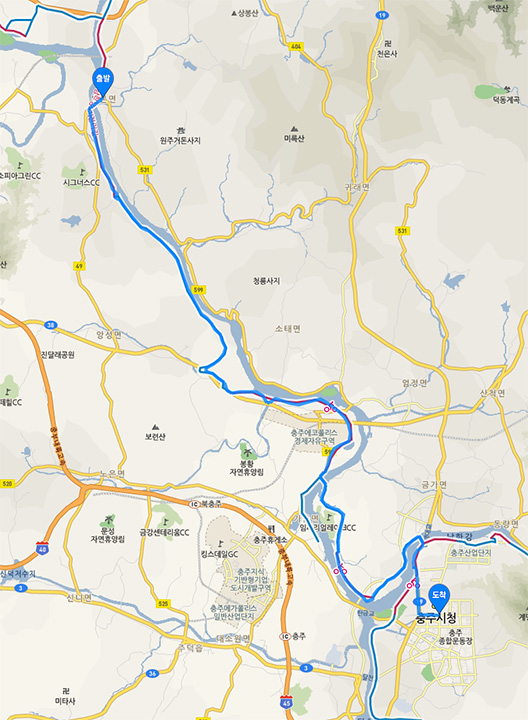
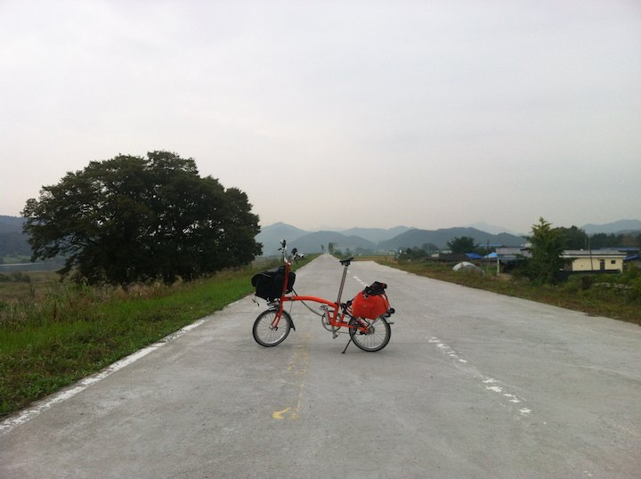
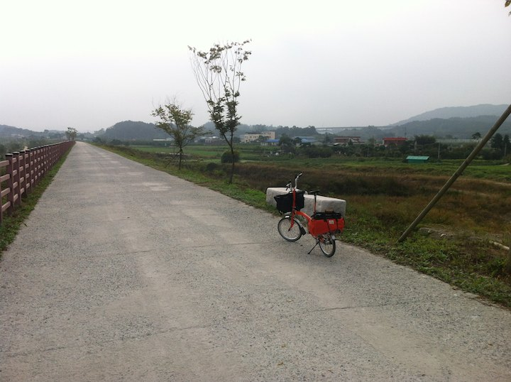
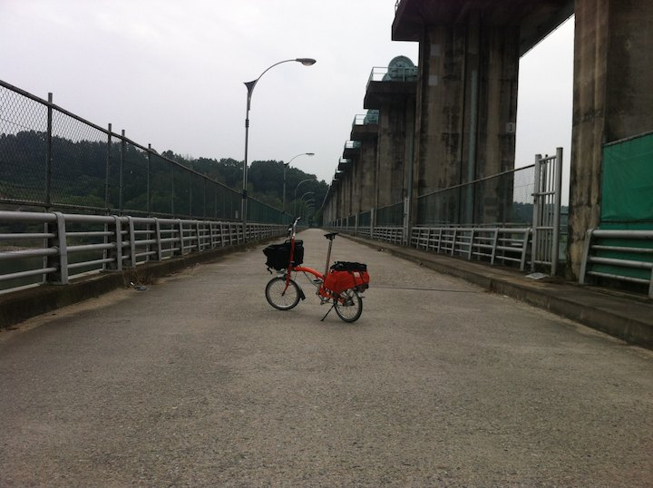
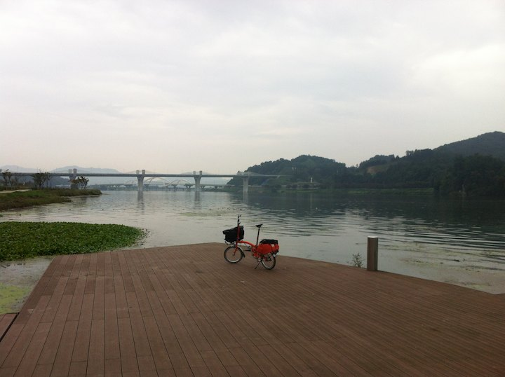

# 부론면에서 충주까지

이 날은 부론면에서 충주까지 7 시간 45 킬로했다.

부론면 강둑에서 찰칵.
굴뚝에 연기나는 집들이 보인다.
그냥 들어가 밥 한끼 얻어먹고 싶어지는 풍경이다.

우둘투둘한 둑길이 끝나고 잘 포장된 국도가 나온다.
아침이라 차도 거의 없다. 
도로가 좋아서 신나게 밟았는데 이게 문제였다.
아침부터 너무 열심히 밟았더니 엉치뼈 쪽에 통증이 시작되었다.

둑길은 보통 이렇게 콘크리트라 노면이 좋지 않다.
엉치가 아픈 상태에서 자전거가 덜컹거리니 통증이 더 심해진다.
타고 있을 수가 없을 지경이 되서 끌바를 했다.
충주까지 25 킬로나 남았는데 계속 끌바를 해야할지도 모른다;

충주 하류 조정지 댐. 상류 충주댐의 보조라고 한다.
충주시는 이 두 댐의 사이에 있다.
조정 경기장도 이 댐위에 있다.
등을 아치로 구부리니 엉치 통증이 조금 가신다.

충주시로 들어가는 길. 강변이 아름답다.

충주시가 보이면서 부터 비가 내리기 시작했다.
모텔 촌을 이리저리 찾아서 임광사거리 부근에 체크인.

나중에 보니 좀더 가면 충주역 앞에도 모텔이 많았다.
충주역은 자전거길이 지나가는 곳이라 이쪽에 숙박하는 것이 더 유리해 보인다.

자외선을 막기위해 날씨와 상관없이 긴바지에 긴팔을 입어야 한다는 사실을 깨닫고
충주에서 패드 달린 긴바지를 구입했다.

엉치뼈 통증이 가라앉기를 기도하며 미라처럼 누워서 12 시간을 보냈다.
몸이 조금 불편하니 벌써 사진량이 확 준다.
