# 충주에서 문경까지

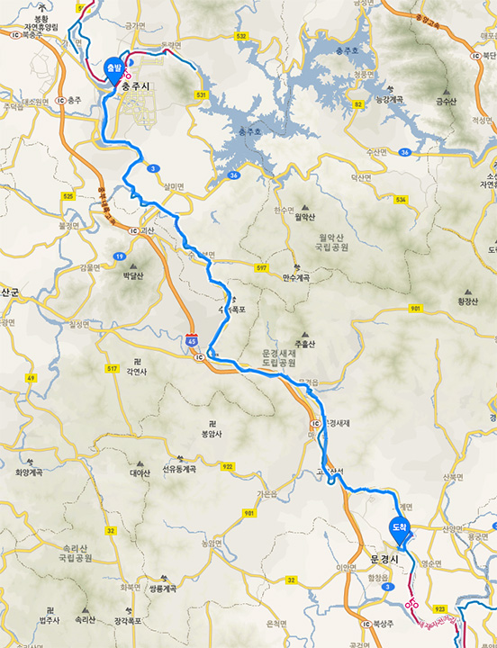

이날은 충주에서 문경시 점촌역까지 12 시간 80 킬로 했다.

남한강길은 충주 탄금대에서 끝나고 상주까지 새재길이 시작된다.
새재길에는 소조령과 이화령이 있다. 뭔지는 잠시 후에;

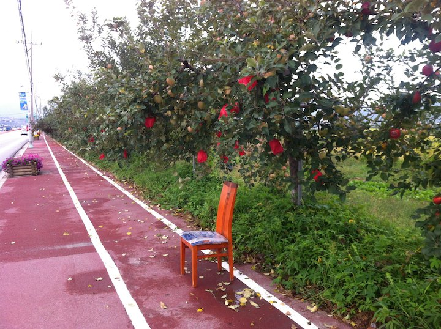

충주 외곽으로 나오니 도로변에 사과나무가 끝이 없다.
길까지 가지가 뻣어나와 잘못하면 사과와 충돌한다.

충주를 지나서 이제 마지막으로 남한강을 볼 수 있다.
도로변 나무들도 너무 아름답다.

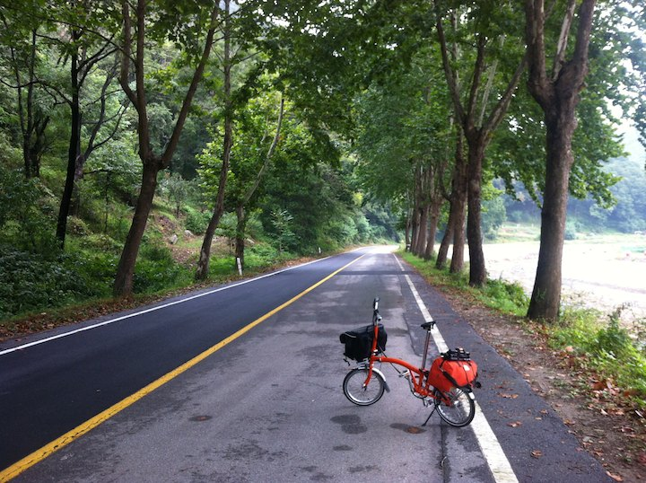

길을 잘못 들었다. 하지면 역시나 아름답다.

충주에서 30 킬로 안 가서 수안보온천이 나온다.
여기서 점심을 든든히 먹었다.
수안보를 지나면 소조령이 나오고 바로 이화령으로 이어진다.

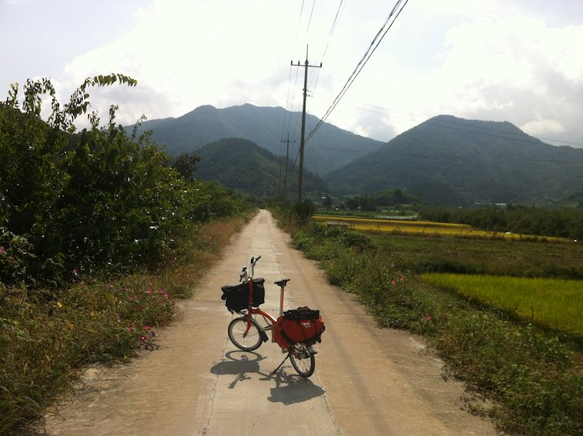

이제 강은 없다. 산세가 심상치 않다.

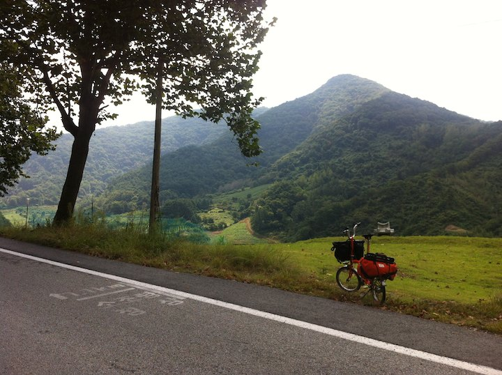

소조령 초입이다. 평일이라 그런지 아무도 없다.

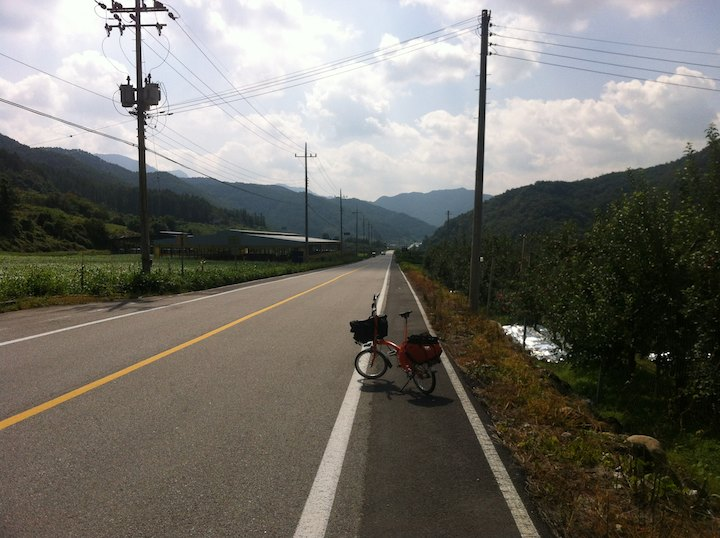

한 시간 넘어 자전거를 밀어 소조령을 넘었다.
잠시 탄탄대로가 나온다. 잠시다;

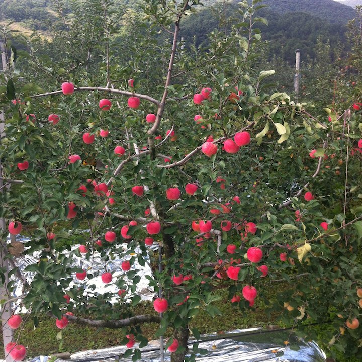

사과나무도 보인다.

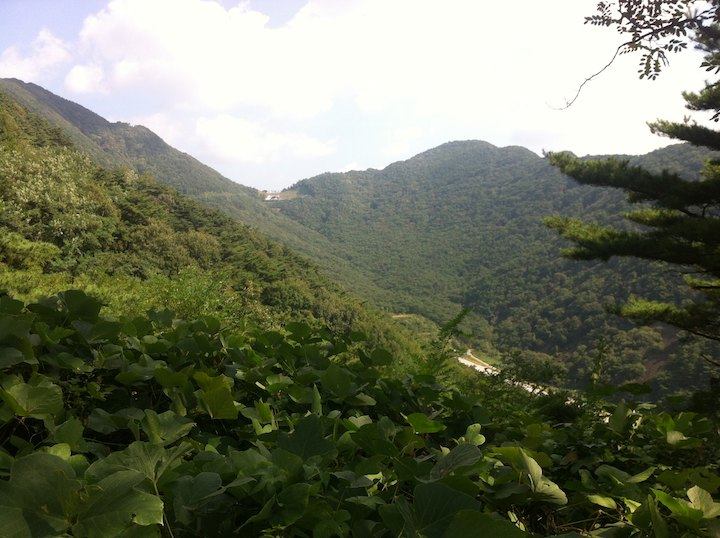

이화령을 2 킬로쯤 오르면 정상이 멀리 보이기 시작한다.
꿀벅지 로드 두 대가 슉슉슉하면서 지나간다.
난 저기까지 2 킬로 더 밀어야 한다. 

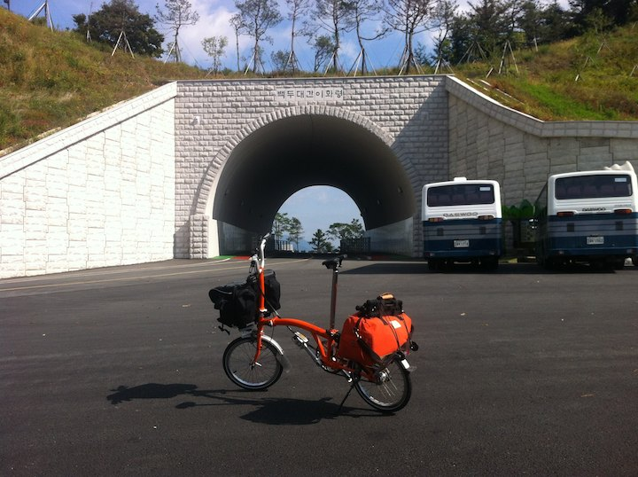

두 시간 밀어 정상에 도착했다; 이화령은 종주구간중 가장 높은 곳이다.
저 구멍을 지나면 문경으로 이어지는 다운힐이다.
다운힐도 쉽지 않았다. 브레이크를 10 분 넘게 잡아야해서 손이 아프다;

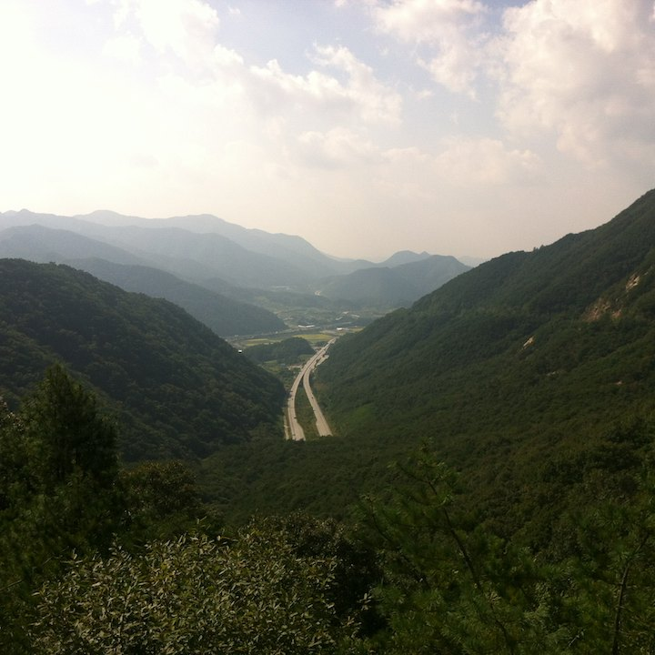

이화령을 넘는 모든 사람들이 찍는 사진;

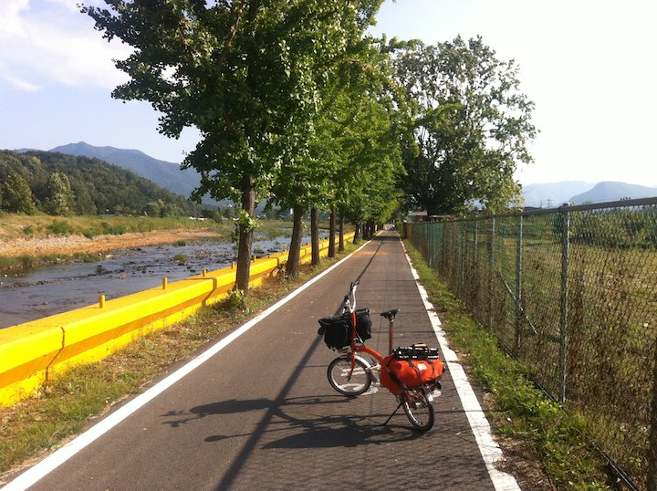

이제부터 이 물들은 한강으로 안 가고 낙동강으로 간다.

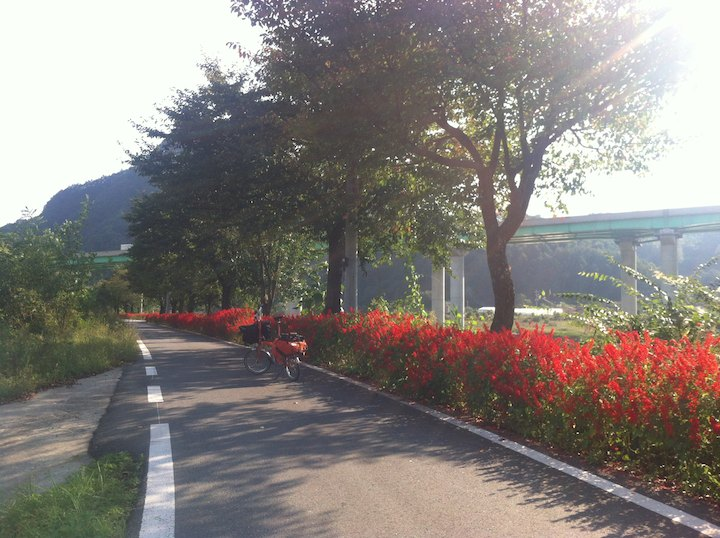

끝나지 않는 사루비아길. 그 길이가 안동의 코스모스길과 쌍벽을 이룬다;

[https://vine.co/v/hrUrw9pI9nJ](https://vine.co/v/hrUrw9pI9nJ)

동영상도 찍었다;

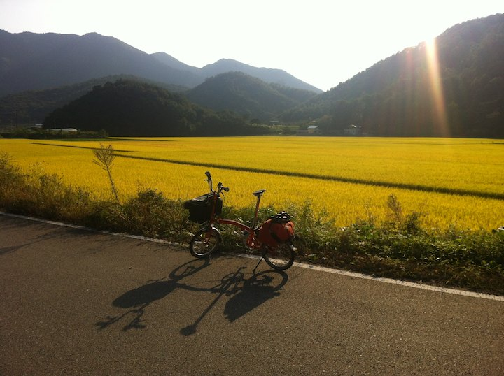

국도로 올라오는 순간 황금빛에 뜨악;

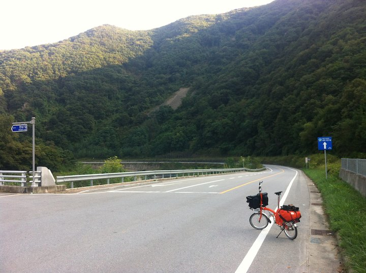

문경은 산세가 풀려나가는 곳이라 풍광이 장난이 아니다.

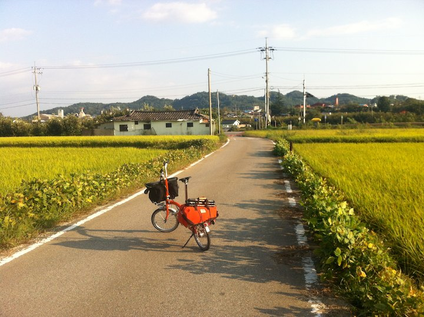

심심한 둑길 대신 산과 마을을 통과하기 때문에 볼 꺼리도 무척 많다.

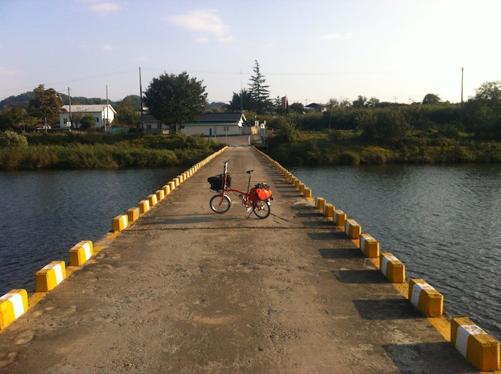

찍어도 찍어도 끝이 없다. 다 찍을 수가 없다.

여행중 가장 아름다운 하루였던 것 같다.
