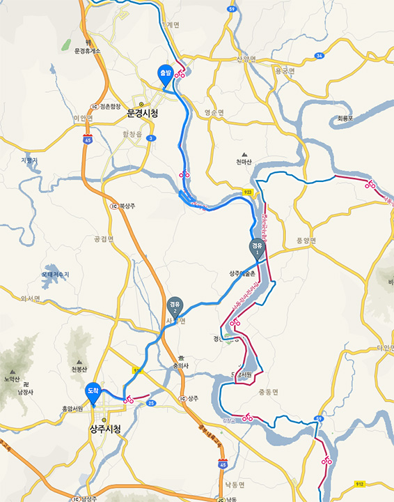
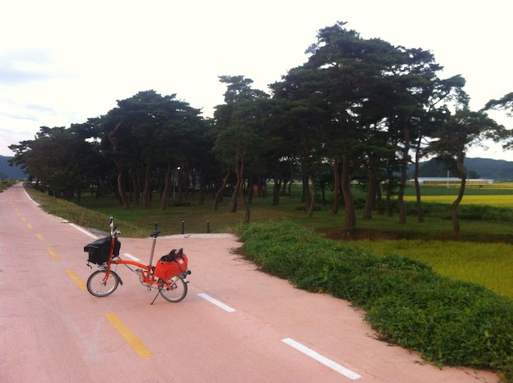
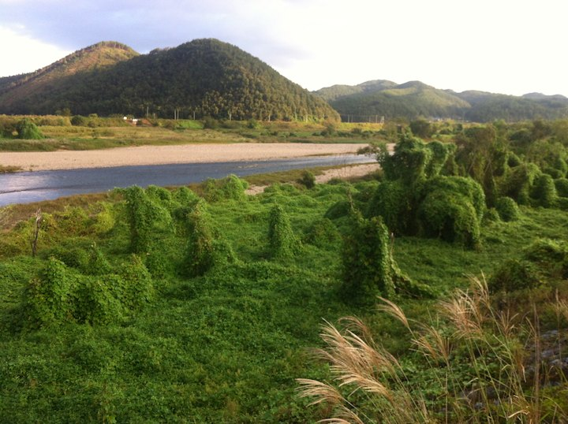
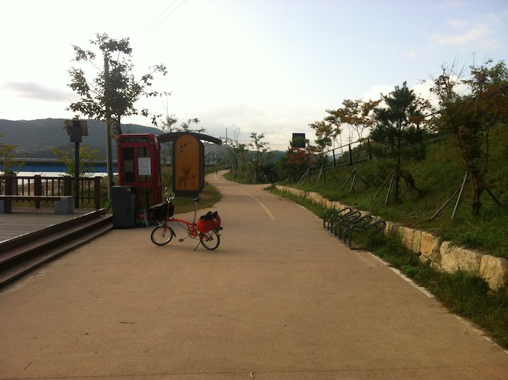
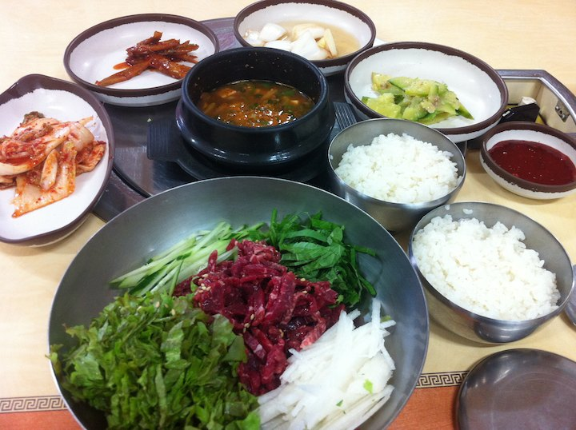

# 문경에서 상주까지

이날은 문경에서 상주 상풍교 포인트까지 20 킬로 진도 나갔다. 지도에서 경유1 지점.

[https://vine.co/v/hr9hemLmb1M](https://vine.co/v/hr9hemLmb1M)

문경시내를 나오면 영강의 조용한 아침풍경에 젖을 수 있다.

마을마다 소나무 군락이 단장되어 있다.

영강의 이국적인 풍경.

영강과 낙동강이 만나는 곳이다.

새재길 종점 상주 상풍교에 포인트. 썰렁하다;

상풍교에 도착해 보니 낙동강 길의 시작은 저 위 안동이었다.
이왕 온 거 안동 구경도 하자 싶어 상주터미널로 16 킬로 이동해서 안동행 버스를 탔다.
안동까지는 두 시간여 걸리는데 내일은 이 길을 자전거로 돌아내려오는 일정이 될 터였다.

갑자기 사타구니에 문제가 발생한다. 
패드바지가 두툼해 팬티를 입지 않고 이틀을 타서 피부가 계속 쓸렸는데
거기에 염증이 생겼는지 버스 안에서 갑자기 부어오르기 시작했다.
아침엔 무리없이 35 킬로를 밟았는데 버스에서 내리자 허벅지 안 쪽이 부어 걷기도 힘든 지경이 되었다.
살면서 처음 경험하는 증상이라 당황;
약국 가니 할아버지가 후시딘을 주길래 받아들고 모텔에 체크인했다.
해는 중천이었지만 자전거 타고 다닐 상황이 아니었다.
내일도 어려울 것 같았다.

침대에 퍼져있는데 화덕헌 님 문자가 도착한다.
'낼 같이 달립시다', '아 제가 사타구니 문제가 생겨서 어찌될 지 모르겠습니다', '후시딘 효과 없는데요, XXX 들어있는 소염제 먹고요, XXX 들어있는 광범위 연고 바르세요'.

덕헌님 사모님이 약사시다. 처방대로 먹고 바르니 10 분도 안 되 붙기가 내려가기 시작한다.
'아, 다행이다, 다행이다'

이 먹방을 넣지 않을 수가 없다.
'농민후계자식당'이란 곳에서 파는 7 천원짜리 육회비빔밥이다.
한우가 밥한공기 넘게 들어있다. 사진의 고기 아래 전부 고기다. 점심에 먹고 너무 감동하여 저녁도 같은 것을 먹었다;

다음 날부터 낙동강 길을 시작하는데 지도를 보니 남한강 길과 분위기가 많이 달랐다.
