# 안동에서 경천대까지

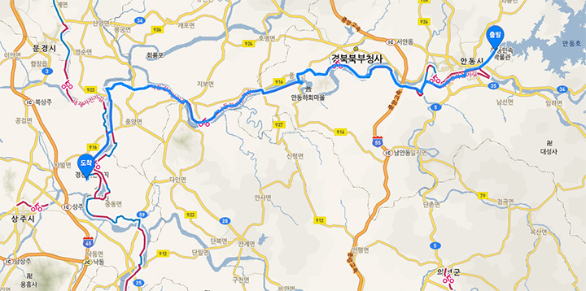

이날은 안동에서 경천대까지 12 시간 72 킬로 했다.
새벽에 안동을 조금 돌아다녔고 병산서원에 들어갔다 나왔으니 달린 거리는 80 킬로가 넘었을 것이다.

[https://vine.co/v/h6W203Bb1AF](https://vine.co/v/h6W203Bb1AF)

안동 고수부지 새벽. 어제와 달리 몸 상태가 좋다. 달려도 좋겠다. 다행이다.

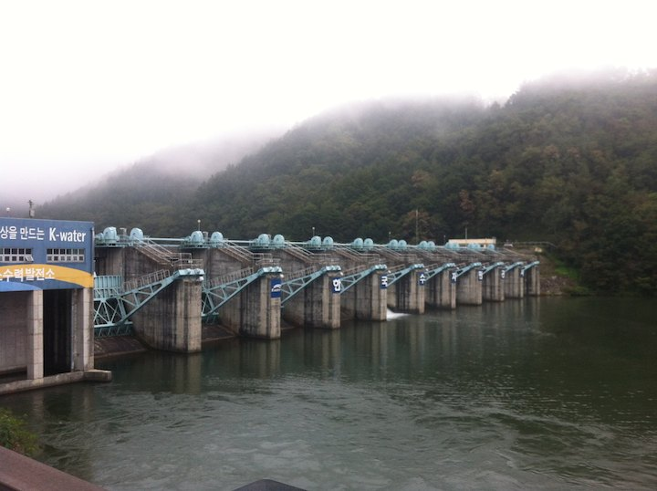

안동댐.

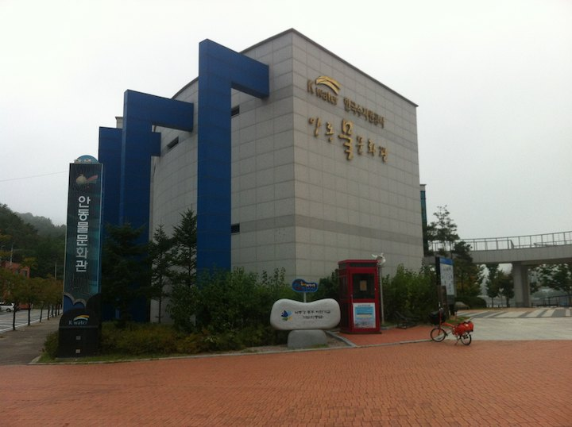

안동댐에서 조금 더 들어가면 낙동강 길 시발점이 있다.

인증센터에서 인증수첩을 사서 사진속에 자주 등장하는 저 빨간 부스에서 도장을 찍을 수 있다.
여행기들을 보면 이 스탬프 찍기를 모두 좋아하시는 것 같다.
나는 흥미롭지 않아서 하지 않았다.

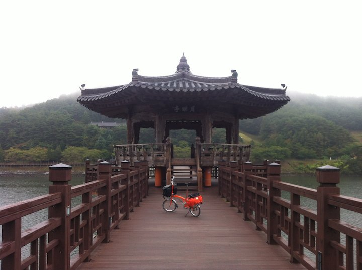

안동호 위에 떠있는 팔각정.

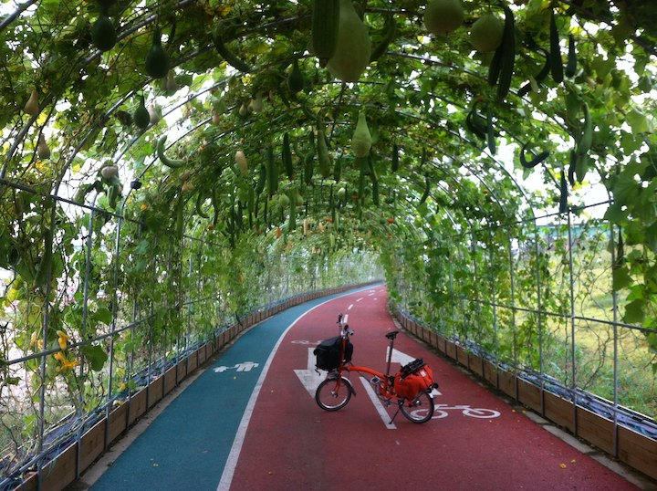

안동 고수부지의 박터널. 귀여운 놈들이 대롱대롱;

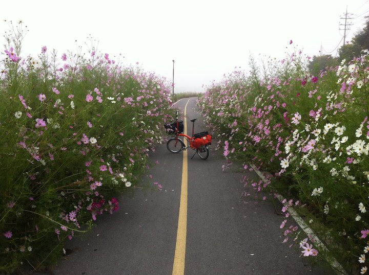

안동 코스모스 길. 진짜 길다; 안개도 깊게 끼어서 분위기 그만이었다.

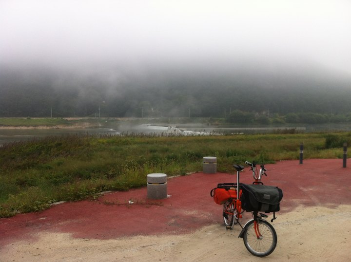

낙동강 길은 중간에 여러 선택지가 있다. 안동에선 위쪽 길을 따라 좀 돌아서 내려왔는데 작은 보가 보인다.
이곳을 지나면 특이하게 안동 쓰레기 매립장을 돌게 되어있다; 길도 언덕이라 자전거를 한참 밀어야 한다.

여기서 부터 기분이 좀 이상했는데 다 돌아보니 낙동강 길 형태는 두 가지다.
기존 둑에 콘크리트나 아스팔트를 깔아 조성한 길, 그게 아니면 기존 도로다.
구미, 대구, 삼천포 근처에 자전거를 위해 강물위에 새로 놓은 길들이 있긴 하지만 잠깐이다.
둑이 없으면 바로 기존 도로들로 연결해 놓았는데 이게 보통 언덕들이다. 
앞으로 보겠지만 낙동강 길은 높은 언덕들을 계속 넘어야한다;

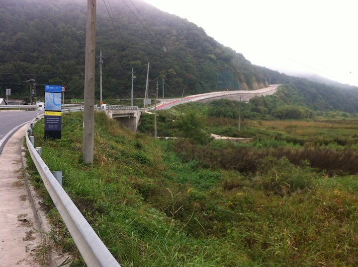

국도다 싶으면 이렇게 언덕이 나온다고 보면 된다.
이런 완만한 언덕은 양반이다;
지나가는 바퀴 큰 자전거들을 보면 이정도 언덕은 문제가 안 되는 것 같다.
짐 실은 브롬톤은 문제가 된다. 미는 방법밖엔 없다;

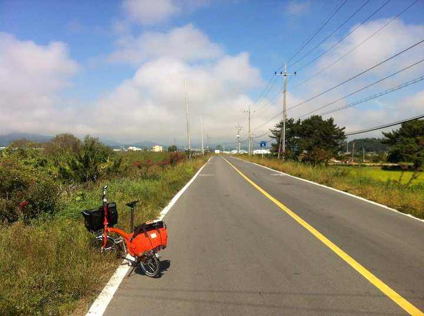

언덕을 몇 개 넘어 강가로 내려오니 좀 평탄해 졌다.

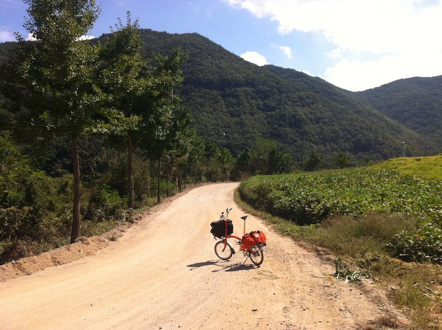

하회마을 전에 병산서원으로 빠지는 길이 있다. 편도 3 킬로 정도 된다.
사진 속 길은 상태가 꽤 좋은데 전반적으로는 매우 안 좋다;
주로 끌바를 했고 너무 안 좋으면 펑크날 까봐 가방을 내가 메고 자전거를 밀었다.

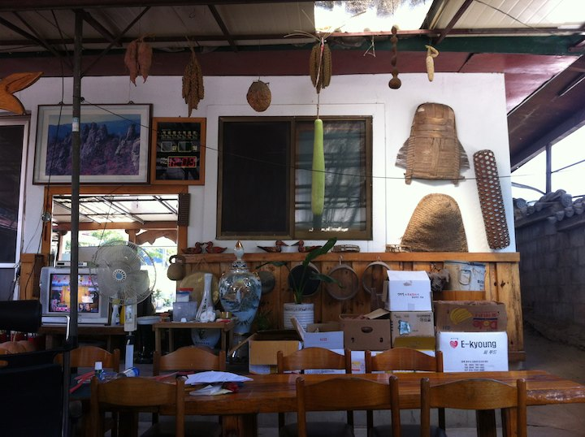

정오쯤 병산서원 입구에 도착. 짐도 맡길겸 점심을 먹었다.
주문한 안동 간고등어 정식은 살짝 부실했지만
나를 위해 20 분 넘게 호박 썰고 두부 썰어 음식 마련해 주신 할머니에게 감사했다.
가게가 뻥 뚤려있어 식탁에 나비들이 왔다갔다 한다. 

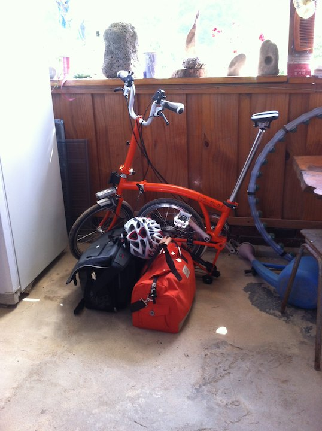

서원에 갔다올 동안 너희들은 여기 얌전히 있어라;

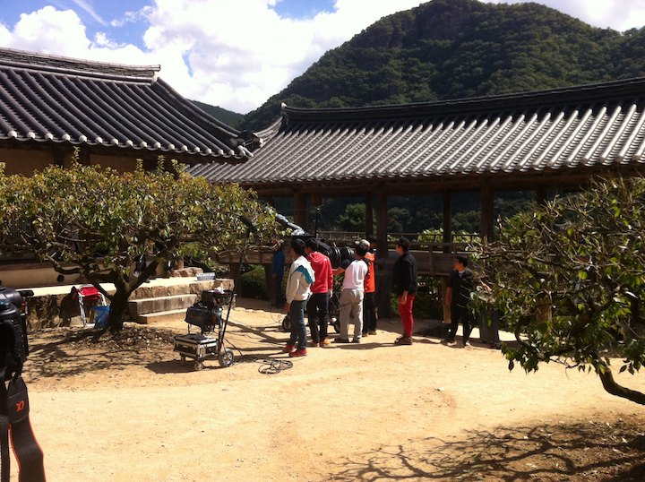

가는 날이 장날; 촬영팀이 와서 뭔가를 열심히 찍고 있다;
초딩 4 명은 구석에서 맛폰 게임을 하고 있다;
먼가 찍으려고 삼각대 자리잡고 있으면 누가 달려와서, '선생님 잠시만 피해주십쇼', '아, 네'

병산서원을 나오면 곧 하회마을인데 들어가보지 못했다.
경천대까지 40 킬로는 달려야 숙소가 나오기 때문.
하루에 200 킬로 가까이 갈 수 있는 자전거들은 숙소까지 이동에 여유가 있겠지만
짐 실은 내 브롬톤은 12 시간 밟아도 80 킬로 간신히 할 수 있기 때문에 숙소까지 거리가 큰 제약이 되었다.

남한강과 다르게 낙동강 주위에는 큰 도시가 거의 없다. 부산을 빼면 구미가 거의 유일.
대구만 해도 그냥 스치듯이 붙어 있어서 도시 서비스를 이용하려면 자전거 길에서 한참을 들어가야 한다.
보가 아니면 낙동강 길 주변에는 편의 시설이 거의 없다고 보면 된다. 끝없는 논이다.
속도가 느린 경우 물이나 비상 식량을 잘 챙겨서 다녀야 한다.

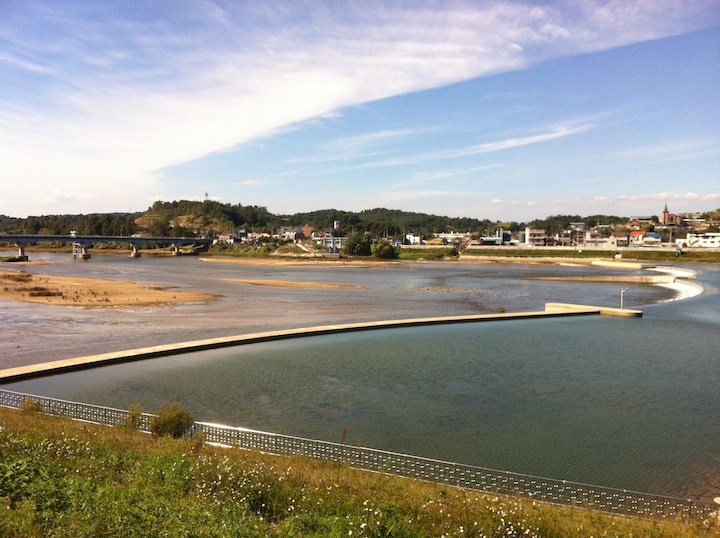

하회마을 조금 지나서 나오는 구담보다. 강건너 보이는 구담리에서 지도에 없던 모텔 표시를 하나 봤다.

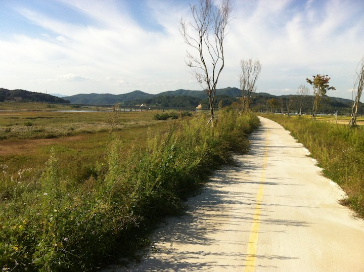

오후 내내 강둑을 달렸다. 해 피할 장소는 전혀 없다.

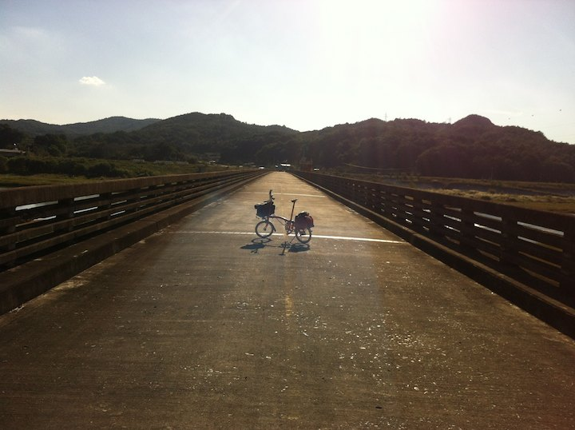

오래된 다리. 자전거 전용으로 재활용 되고 있다.

우망리 지나다 보니 먼가 이쁜 곳이 있다. 20 킬로는 더 가야해서 내려 확인할 시간이 없다.

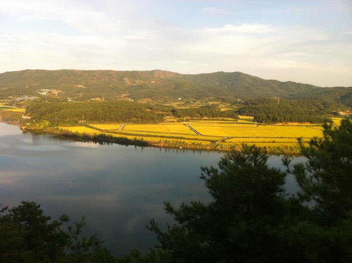

경천대 초입 언덕을 오르고 있다. 말이 안 나온다. 기울기가 40 도는 되는 것 같다.
팔자에 없던 한우를 두 사발이나 먹어서 그런지 오늘은 아픈데가 없다. 그나마 다행이다.

해 떨어진 후 간신히 경천대 모델에 도착했다. 전화도 안 터지는 곳이다.

안동 상주 코스는 비인기다. 이날 라이더 딱 두 명 봤다.
나중에 알고보니 낙동강 길이 전반적으로 그랬다.
길기도 길지만 언덕이 너무 많다.
