# 경천대에서 대구까지

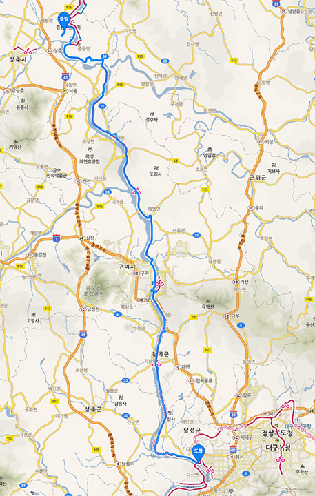

이 날은 경천대에서 구미를 거쳐 대구까지 100 킬로 했다.

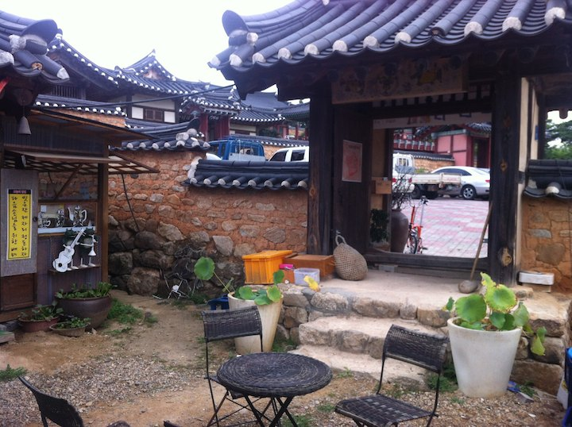

도남서원 앞. 달그락 거리는 소리가 나서 식사되나 여쭤봤더니 안 된다고 하셨는데 행색을 보고 다시 들어오라고 하신다.
특이하게 상 차려 주시면 자기가 가져다 먹어야 한다. 쥔장이 몸이 불편하시다.

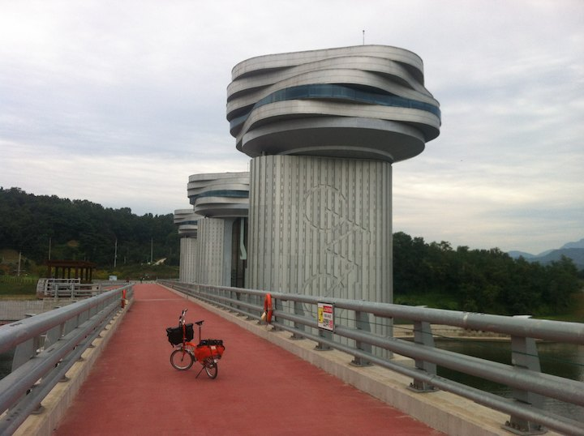

상주보. 이뿐 보 거의 없다.

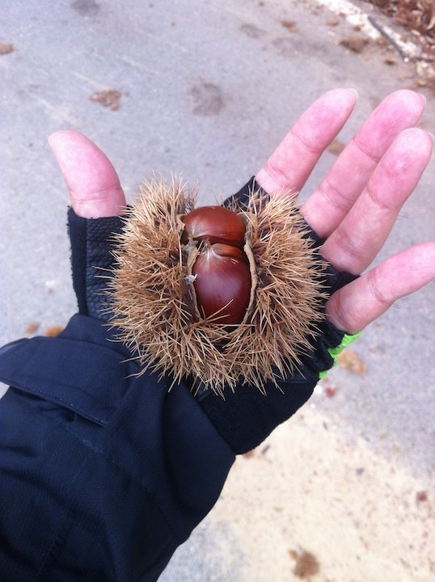

밤들이 길에 지천이다;

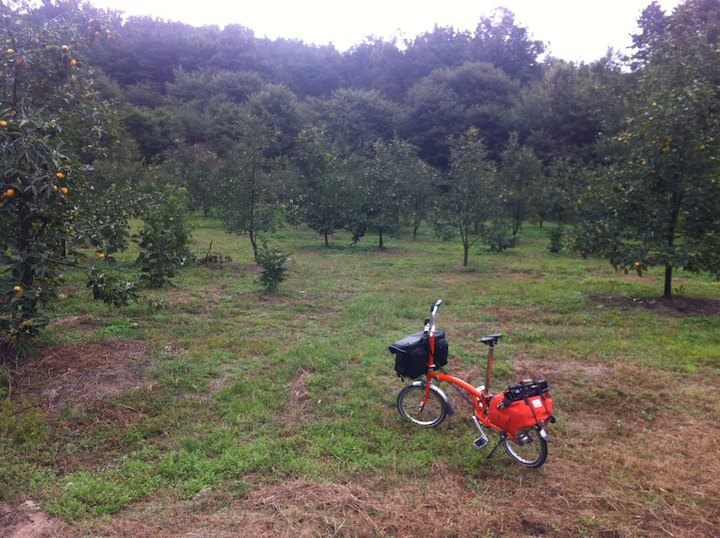

오늘 벌써 3 번째 급한 오르막; 말이 자전거 도로지 언덕 국도에 자전거 표시다;
다른 자전거들은 쉽게도 올라간다; 짐 실은 브롬톤이 문제다.

브롬톤같은 미벨은 국토종주에 적합하지 않은 것 같다.
느리지만 샤방샤방 다니는 맛에 탄다고 해도 고개 넘기가 너무 힘들다. 고개가 많다.
종주를 시작하면 자전거 접을 일이 거의 없다.
자전거 모자 쓰고 모텔 들어가면 쥔장들이 창고 열쇄들고 뛰어나온다;
꼭 점프가 필요하면 시외버스 화물칸에 넣으면 된다.
일반 자전거도 별 불편함이 없을 것 같다.

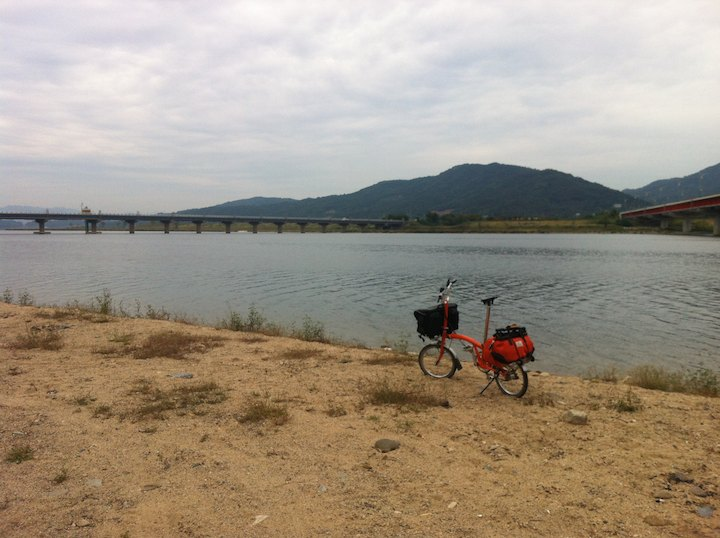

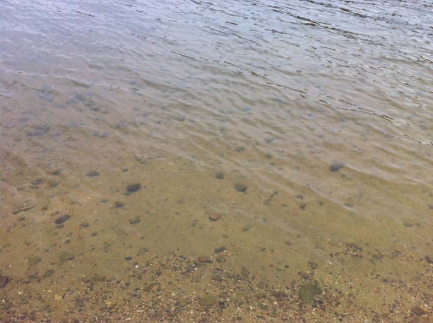

녹조 없다고 트윗하다 혼났다. 녹조는 여름에나 생긴다고 한다. 구미 전에는 강물이 아주 깨끗하다.
구미부터는 아주 더럽다;

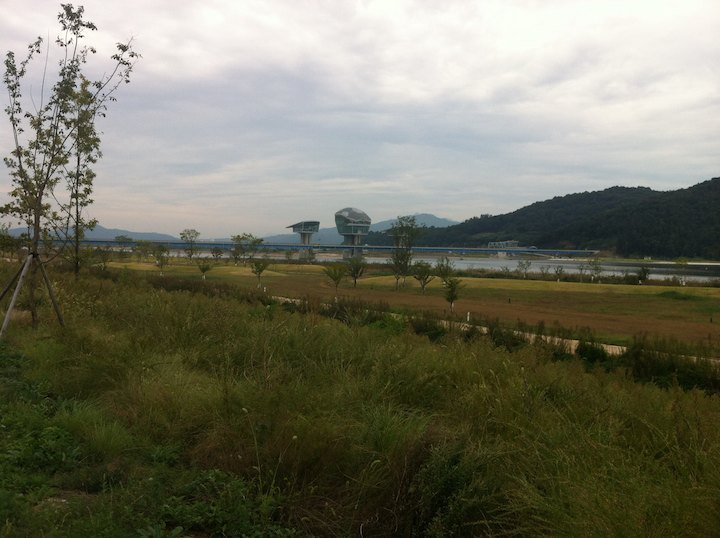

구미보. 축구공인줄 알았는데, 찾아보니 거북이 모양이란다; 안 이뻐서 이제 보 찍을 맘이 안 생긴다.

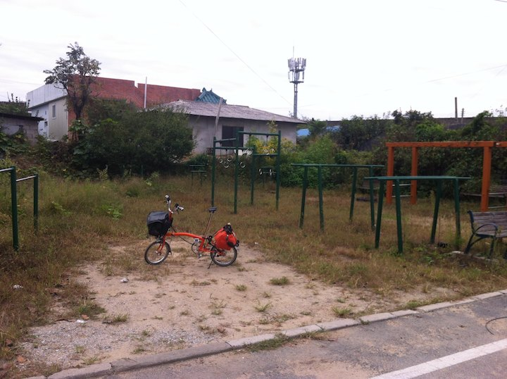

구미 들어가기 전. 자전거 길이 오랜만에 마을을 지난다.

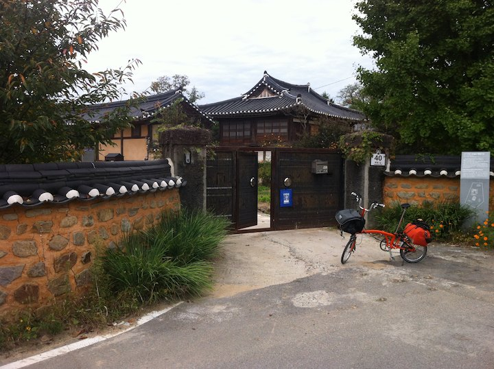

이름있는 기와집도 있다.

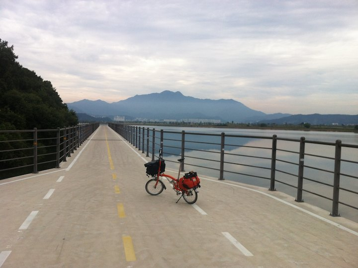

구미 들어가는 길. 도시 근방이라 다르다. 다른 곳 같았으면 그냥 언덕 넘는 국도를 타야했을 것이다;
구미 뒤의 근육질은 금오산.

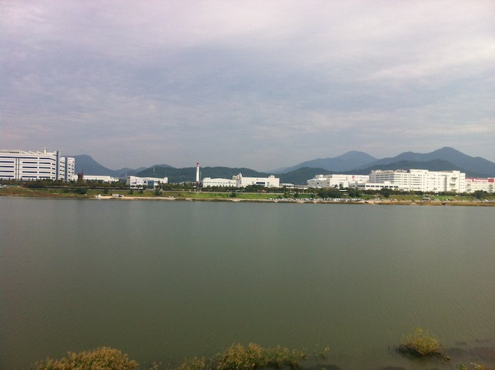

LG 디스플레이가 보인다. 공장이 여기 있구나. 구미에는 진짜 공장이 많다.

오후 2 시쯤, 구미에서 늦은 점심을 해결하였다.

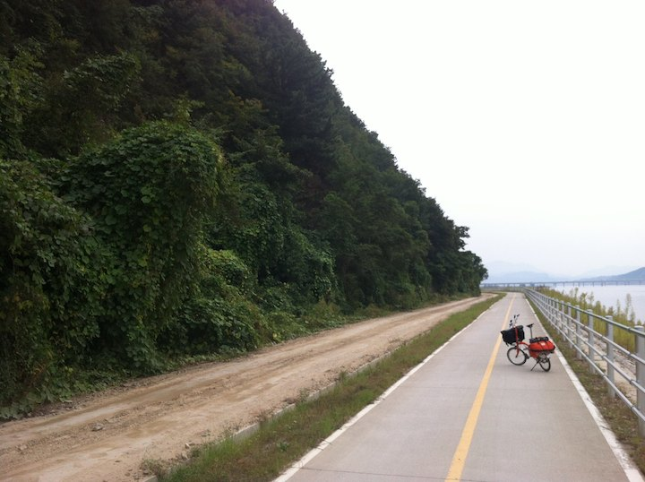

오후 5 시 반을 넘고있다.
구미를 떠나 정신없이 달렸다.
해지기 전에 44 킬로를 떨어져 있는 대구에 들어가야 한다.
아직 멀다.

오후 6 시 반. 비가 내린다. 해도 졌다. 멀리 대구 불빛이 보이기 시작한다.

오후 8 시. 대구 모텔에 체크인. 대구부터는 평일 모텔가격이 2 만원이다. 싸다.
이 날은 토요일이라 만원 더 줬다.
그런데 자전거 길에서 값싼 모텔촌까지 택시로 7 천원 거리다. 멀다.
강정보 근처에 게스트하우스가 하나 있었는데 거기에 들어가 볼 껄 그랬다.

강정보 들어오는 길 야간 풍경이 꽤 멋있었다.
사진찍을 겨를은 없었다.

한강과 낙동강은 느낌이 매우 다르다. 한강은 강 바로 옆에 집들이 계속 있고 하류는 무려 서울을 가로 질러 흐른다.
평일이건 주말이건 고수부지는 미어 터진다.

낙동강은 주위에는 논 밖에 없다.
고수부지가 조성된 곳은 많은데 거의 텅 비어있다.
토요일인데 대구쪽 고수부지나 강정보에도 사람이 거의 없다.
서울처럼 집앞이 개천이고 한강이고 이렇지 않아서 고수부지까지 나오려면 한참 차를 타야한다;
