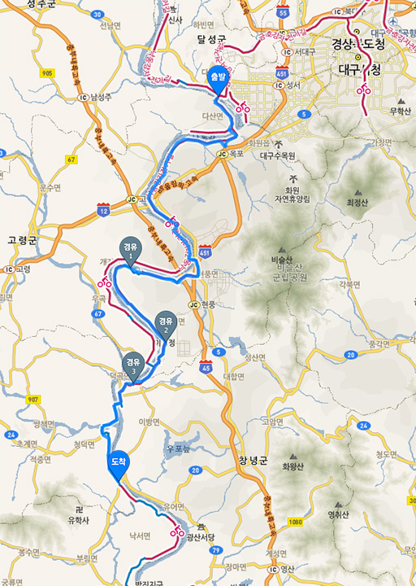
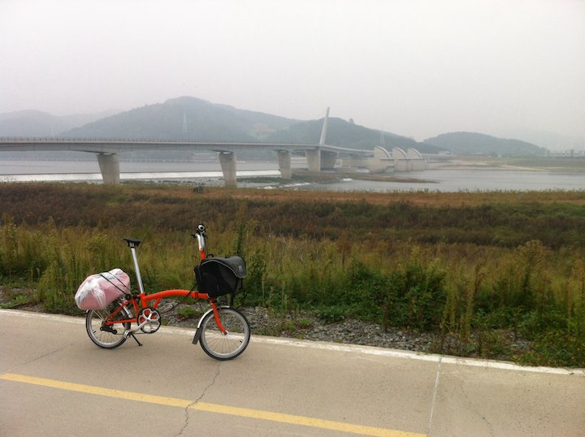
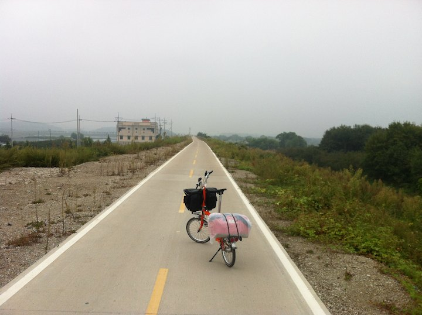
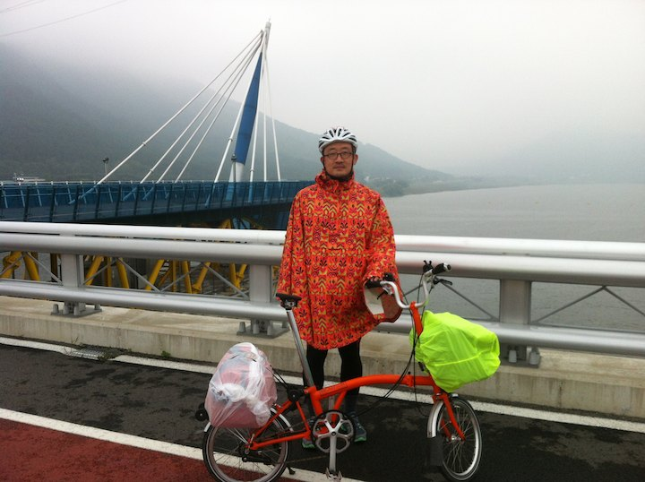
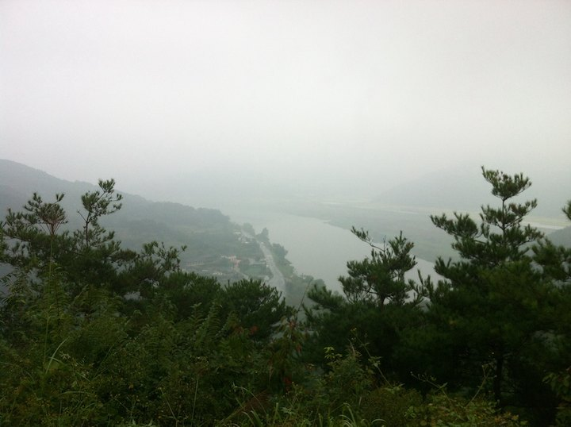
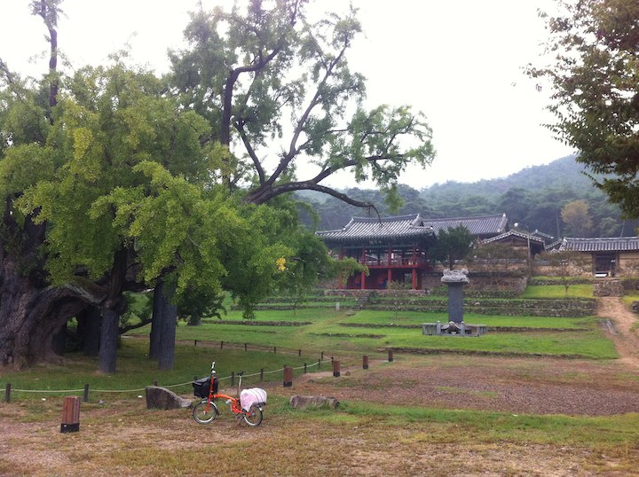
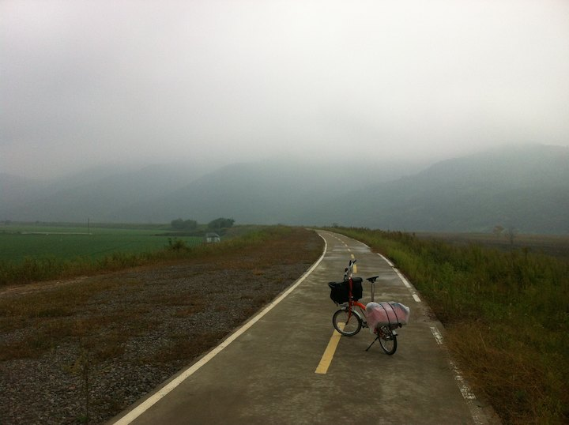
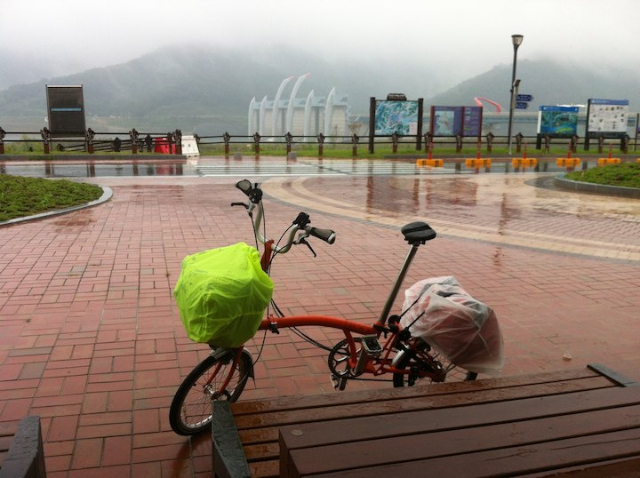
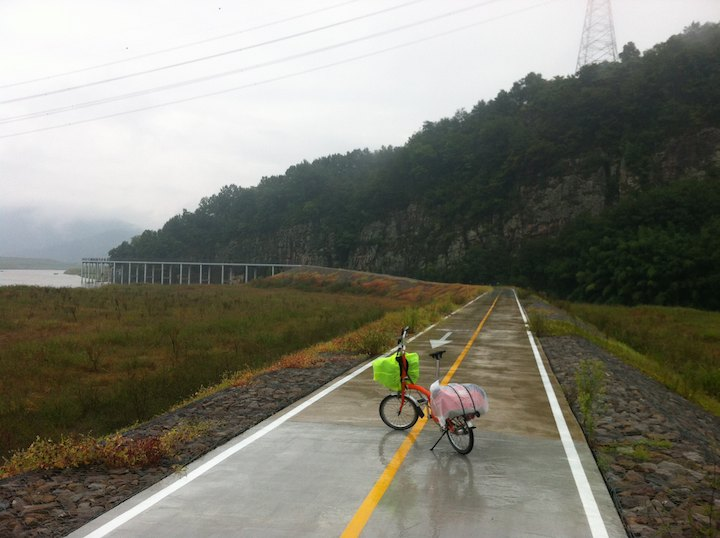

# 대구에서 적교까지

이날 대구 강정보에서 합천 적교까지 65 킬로 이동했다.

임도가 두 군데 있는데 바닥의 우회 표시를 따라 모두 회피할 수 있었다.
하나는 지도에서 낙동강 서쪽에 있는 개진면 통과 임도이고,
하나는 경유 3 지점의 무심사 임도이다.
무심사 임도 우회길은 정확한 기억이 없어 푸른색 선이 그냥 임도를 지나게 했다.

경유 2 지점에는 그옛날손짜장이 있다. 추천한다, 손짜장;

대구 강정보.

종일 비 예보가 있었다. 대구에서 하루 쉴까 하다가 그냥 달리기로 했다.
달리면 몸은 피곤하지만 머리는 맑아진다.
달리면서 비도 맞아보고 싶었다.

[https://vine.co/v/h6wDnBVawg3](https://vine.co/v/h6wDnBVawg3)

새벽 뚝방. 간만에 또 찍었다;

막 낙동강길 중간 지점을 지났다. 안동에서 낙동강 길 389 킬로를 시작할 때는 막막했는데 달리니 또 된다.

달성보. 지나가던 분에게 사진 한장 부탁했다.

비가 오락가락.

도동서원 전 고개를 넘는 중이다; 높고, 가파르고, 노면 망; 노면이 너~ 무 안 좋아서 다운힐에서 끌바해야했다;

도동서원. 

비가 언제 다시 퍼부을지 몰라 마음이 급하다. 
남지까지 가야 묵을 곳이 나오는데 60 여킬로나 더 가야한다.
마음이 급하니 사진 구도도 잘 안 보인다.

서원 주변에는 식당이 있을 줄 알았는데 개점 휴업상태다.
끼니 때울 마을도 지도에 안 보인다.
언덕과 빈 국도와 강둑만 있다.

주로 이렇다.

강둑을 달리다 보면 아주 잠시 구지면 산업단지를 스치는데 지도에서 경유2 지점에 짜장면 간판이 보인다.
포스 쩌는 아저씨가 손짜장을 뽑으신다. 짜장에 들어가는 고기와 재료도 신선하다. 지나다 맛보시길 추천; 

합천창녕보에 도착. 메칸더브이인 줄 알았다;

합천창녕보 전에 무심사 임도가 있는데 다행이 우회도로가 있었다.
비가 퍼부어 앞도 잘 안 보이고 판쵸 때문에 잘 나가지도 않고 도로는 모두 물궁덩이다.
남지까지 가는 것은 어려워 보이는데 지도에 마을 비슷한 것은 전혀 안 보인다.
어라, 그런데 아무것도 없는 적교 삼거리에 뜬금없이 모텔 아이콘이 뜬다. 버근가?

지도의 모텔까지 8 킬로쯤 남았다. 비가 조금 약해졌다.

언덕을 넘으니 집도 몇 채 없는데 진짜로 뜬금없이 모텔이 있다. 두 개나;
삼거리 식당에서 밥먹으며 물어보니 적교가 근처 큰마을의 중간 지점이라 예전부터 만남의 장소였다고 한다.
그런 연으로 여관이 있다고. 적교 때문에 또 살았다;

먼저 보이는 도일장에 묵었는데 여긴 전화가 안 터진다; 삼거리로 100 미터쯤 걸어나가면 잘 터지는데;
전화나 인터넷하실 분들은 적교장에 묵어야할 것 같다.

우포늪이 강건너 10 킬로만 가면 있다.
짐도 있고 포장 안 된 도로가 물에 흥건히 젖어있을 것이므로 가보진 못했다.

