# 적교에서 삼랑진까지

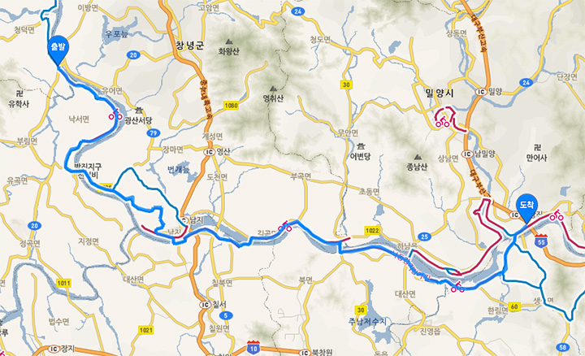

이날 적교에서 삼랑진까지 80 킬로했다.

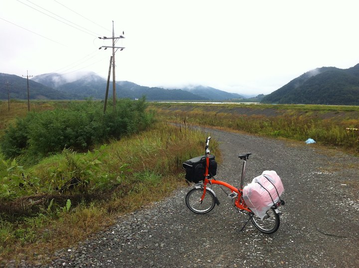

오전 비 예보가 있었는데 다행히 비는 오지 않았다.
부산까지 한번에 갈 수 있는 거리는 아닌데 중간에 어디서 묵어야할지 가늠이 서질 않았다.
그냥 가보기로 했다.

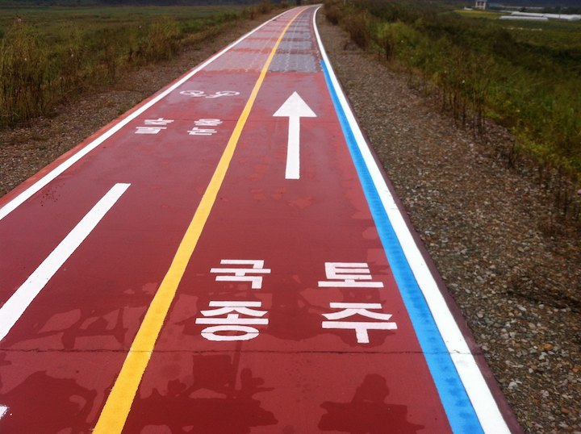

바닥의 국토종주 표시가 은근 응원이 되었다.
이때쯤 되니 진짜로 국토종주가 되는구나 싶었다; 스스로도 황당했다;

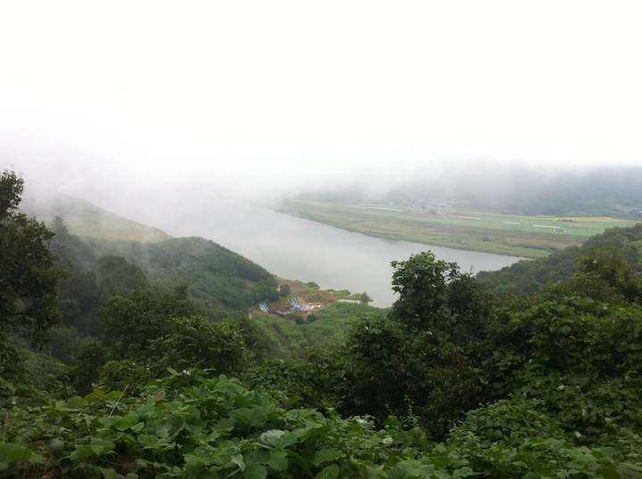

남지 가기전에 어마어마한 언덕이 있다.

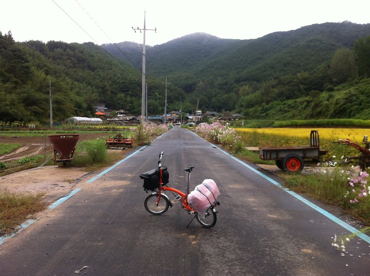

그리고 또 있다. 사진은 그냥 아름다운 농촌풍경이지만 또다른 등반의 시작점이다;

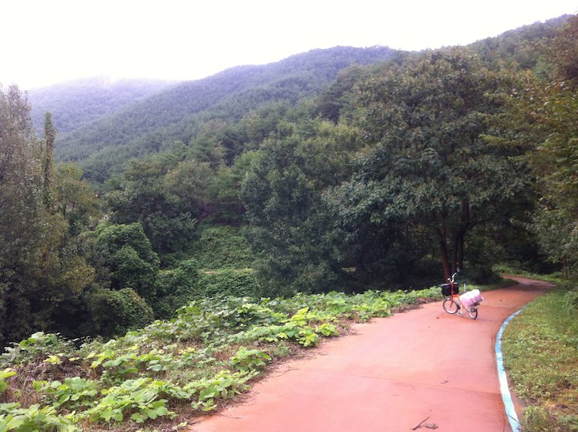

마을 구석의 오솔길 같은 것을 올라가기 시작했는데 어라 이게 끝나질 않는다;

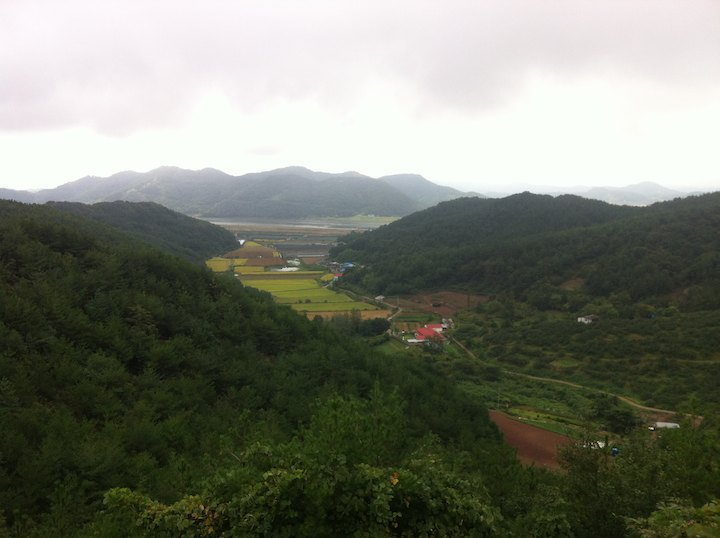

어라, 계속 올라가야한다;

언덕 두 개를 넘어 남지 부근에 도착.
남지 시내까지 들어가기는 힘들어 자전거길 주변 식당을 찾았는데 거의 장사를 하지 않는다.
사람 왕래도 거의 없다.

남지를 벗어날 때까지 식당을 찾지 못해 점심을 거르나 싶었는데 '우리병원' 옆에 뜬금없이 청둥오리집이 있다.
꼭 들어가시라; 2 인에 1.7 만, 1 인에 1 만 하는 오리탕을 내주는데 뚝배기에 가득 고기를 채워준다;
아침에 큰 산을 두 개나 넘었더니 정신줄이 풀려 사진 찍어 놓을 생각을 하지 못했다;

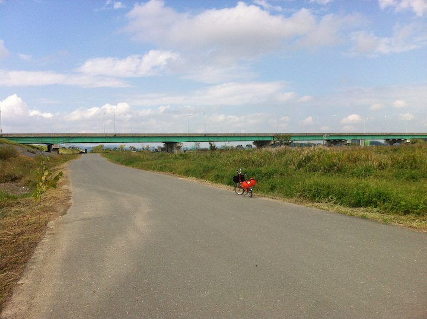

부산에 가까워질 수록 점점 더워진다. 27 도다. 여긴 아직 여름이다.

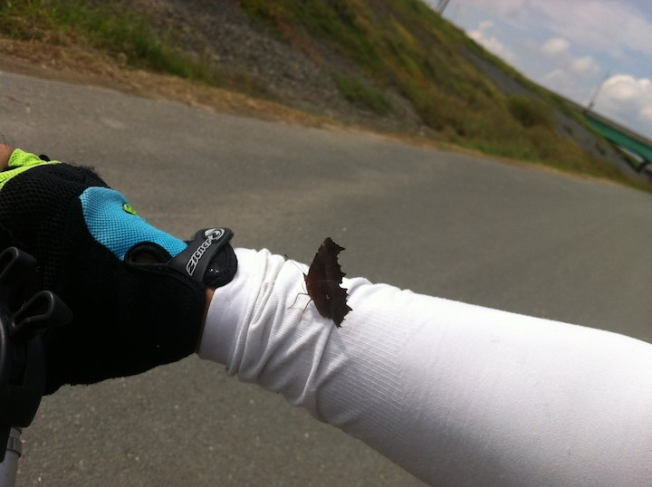

나비가 착륙; 부담스러워 가라고 치니 더 꽉 잡는다; 난감;

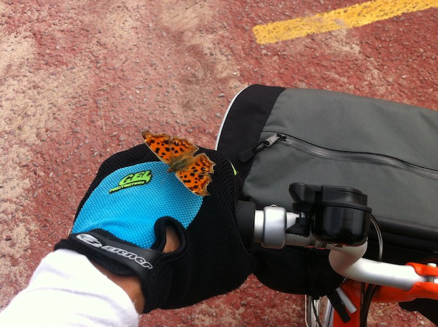

털어 날려 보냈더니 다시 왔다;

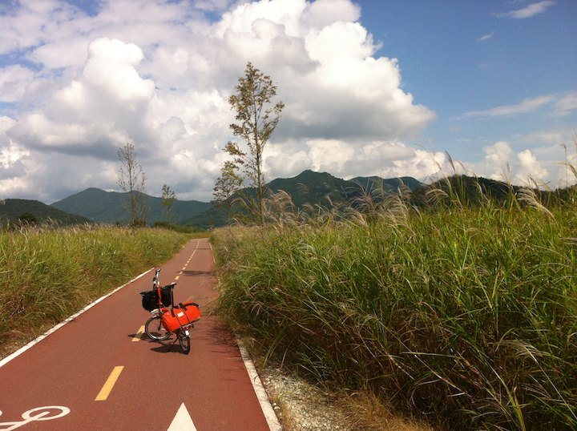

남지에서 20 킬로쯤 떨어진 학포리에 숙박시설들이 보인다. 가보자.

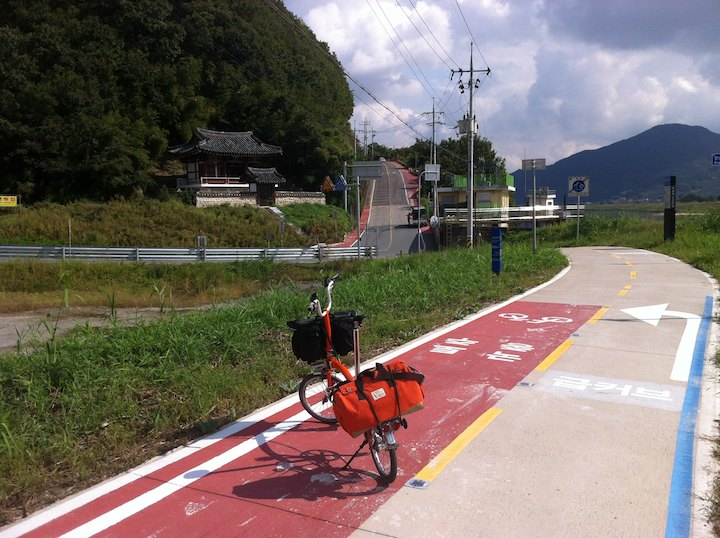

또 언덕이다. 저게 얼마나 높이 올라갈 지는 가보기 전엔 모른다;

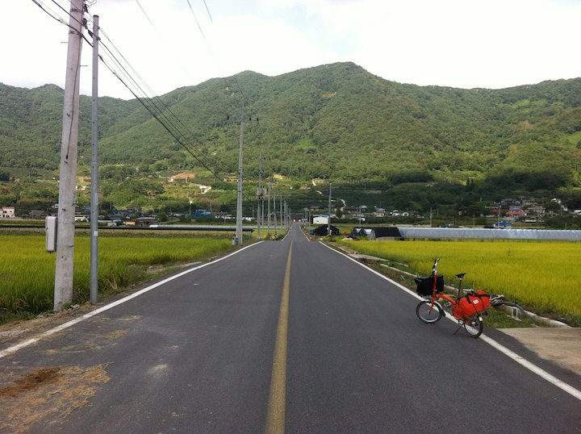

이쁜 마을입구. 사진이 작아 디테일이 잘 안 보인다;

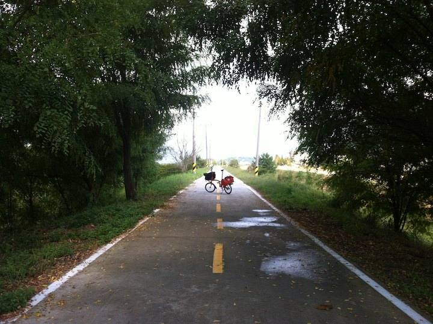

학포리에 도착했는데 해가 3 시간 정도 여유가 있어서 더 욕심을 내었다.
오늘 더 해놔야 내일 부산 도착후 여유가 있을 것 같았다.

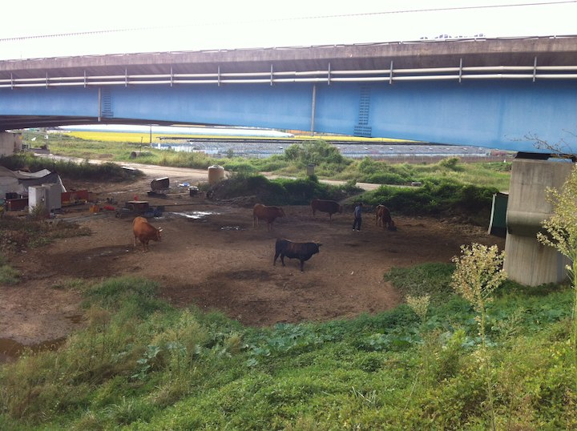

강따라 가면서 쉴 수 있는 그늘은 거의 다리밑 밖에 없다.
다리 그늘에서 아예 소를 치는 분도 계셨다;

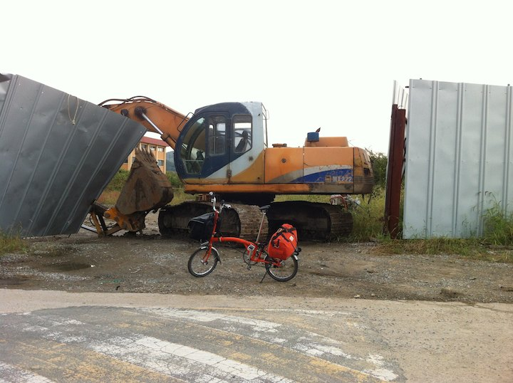

칭구칭구;

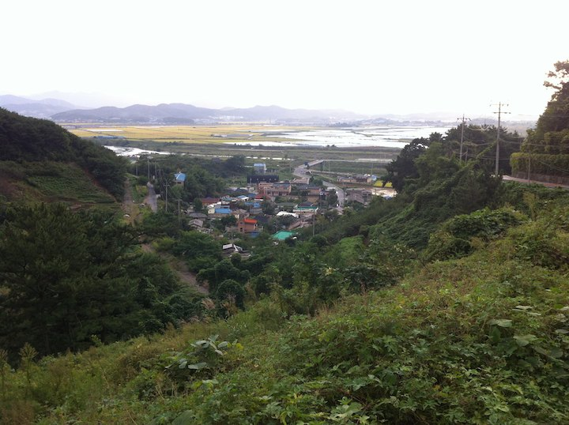

또 언덕이다; 이날의 마지막 언덕이면서 종주의 마지막 언덕이었다;

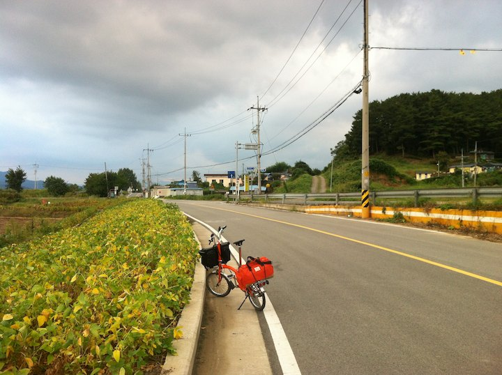

해질녂 풍경도 좋았고 여관까지 거리도 가까워 사진 많이 찍었다.

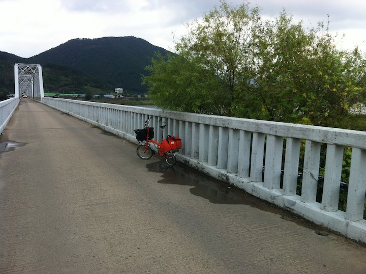

이 다리만 건너면 삼랑진이다. 열차 소리가 밤새 멈추지 않는 곳이었다.
