# 삼랑진에서 부산까지

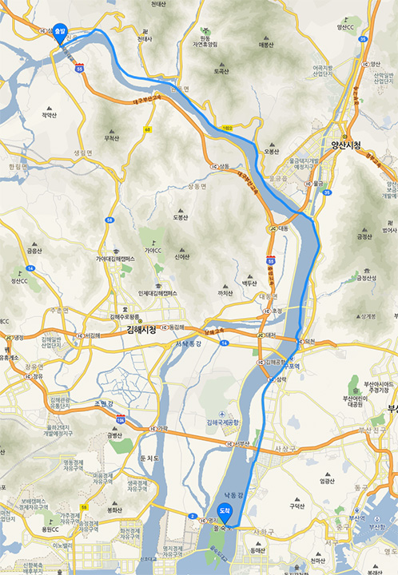

여행 마지막 날. 삼랑진에서 부산까지 46 킬로 했다.

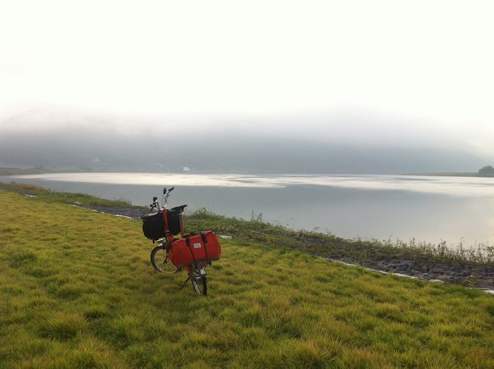

평소의 절반만 하면 여행의 끝이다.

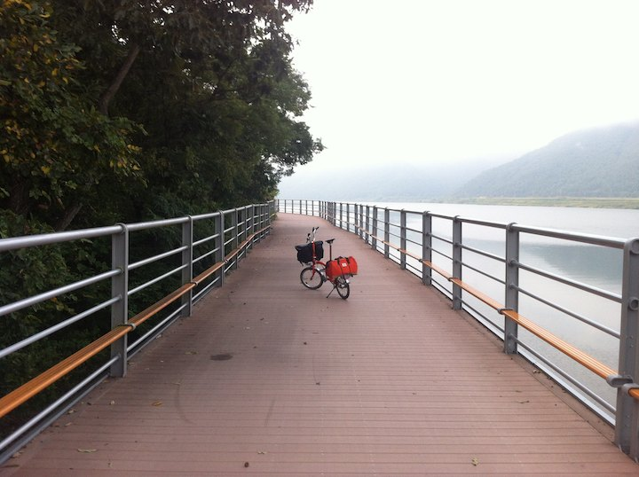

삼랑진 나가는 길. 언덕 대신 자전거 길이 만들어져 있다.

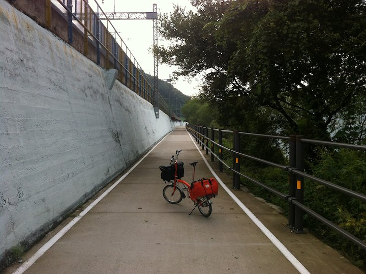

이렇게 기차길을 40 여 킬로 따라가면 부산이다.

삼랑진에서 부산가는 길은 너무 잘 되어있어서 구름을 밟으며 가는 기분이다.

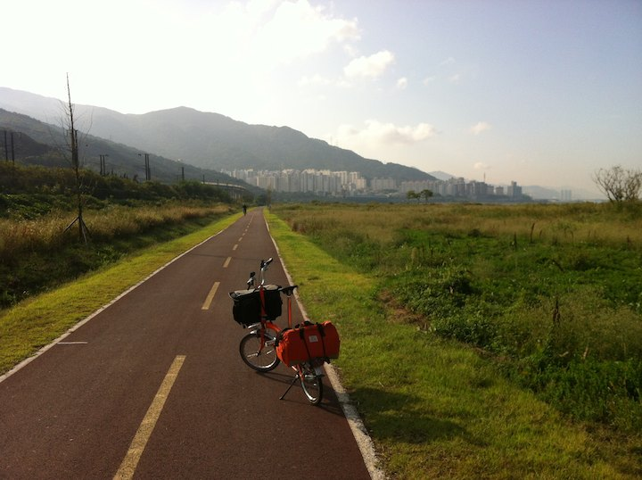

드뎌 부산이 보인다.

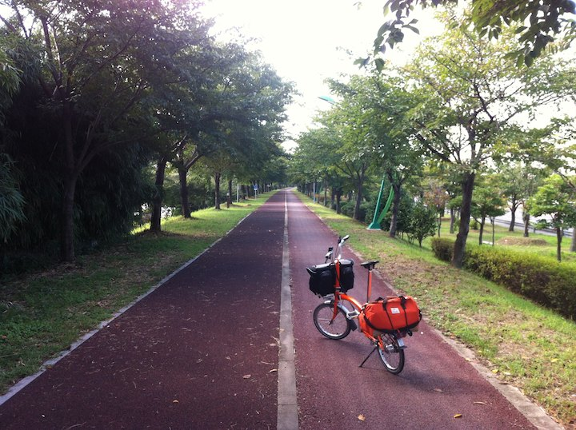

부산에 들어서면 길이 갑자기 험해진다. 엉덩 아프다;
노면 보느라, 개 피하느라, 사람 피하느라, 다른 자전거 신경쓰느라 갑자기 피로가 몰려온다;
을숙도까지 내려오니 이제 인파가 좀 덜하다. 휴;

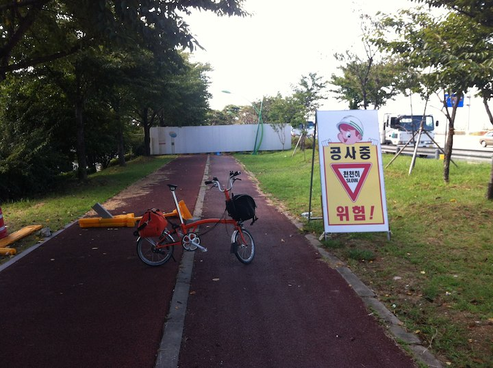

6 킬로 남았는데 갑자기 공사중;

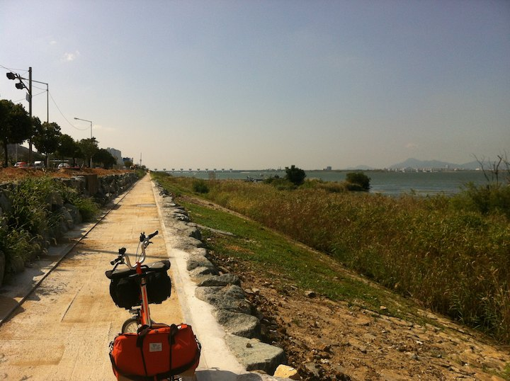

보니까 자전거 도로를 새로 닦고 있다.
멀리 종점인 을숙도와 낙동강 하구둑이 보인다.

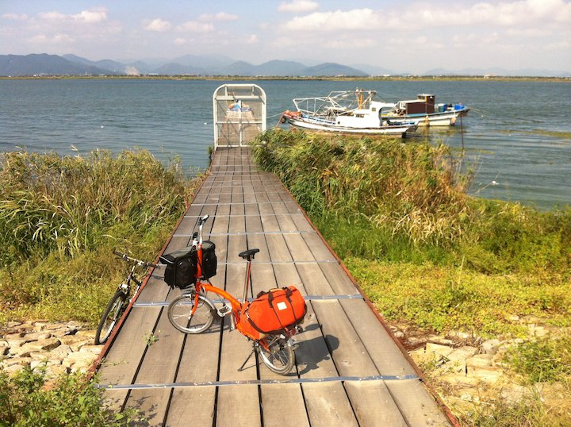

칭구칭구;

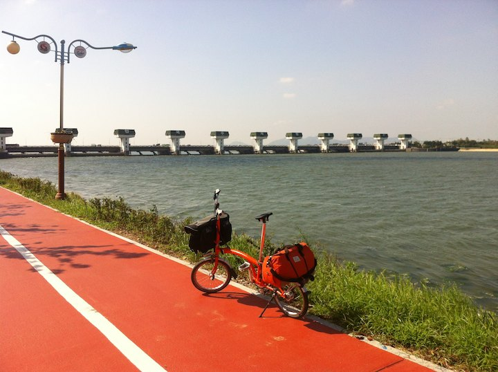

저기만 건너면 종점이다. 여행중에 진짜 다리를 셀 수 없이 건넜다;

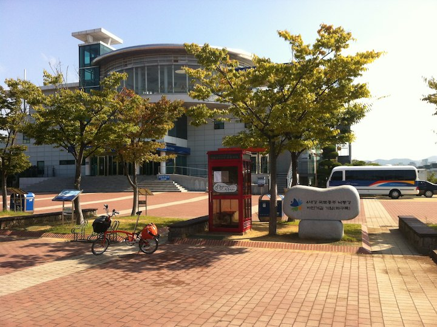

다왔다. 낙동강 길 종점이다. 좀 덜 썰렁하지만 역시나 썰렁하다;
이제 막 종주 출발하시는 아저씨하고 잠깐 얘기하고 단체로 종주 떠나는 팀의 들뜬 모습을 보았다.
모두 목적지까지 무사히 도착하실 수 있기를.

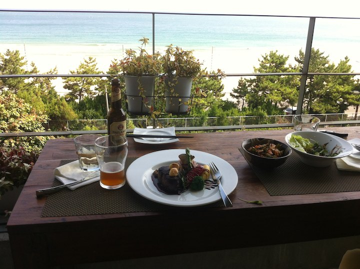

먼가 갈치국 스런 음식을 상상했는데 덕헌님이 송정의 멋진 레스토랑에서 스테이크를 사주셨다.
이 여행의 원인을 제공하신 분도, 아플 때 도움을 주신 분도, 여행의 끝을 마무리 해주신 분도 덕헌님이다.
저지르고 계신 일들 모두 잘 되시기를. ^^

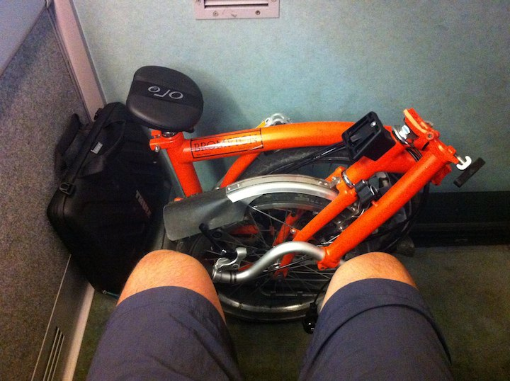

KTX 특급을 타보았다. 또 언제 타보리; 7 만원의 압빡; 좌석 사이가 진짜 넓다. 함께 고생한 브롬톤을 무릎에 둘 수 있었다.

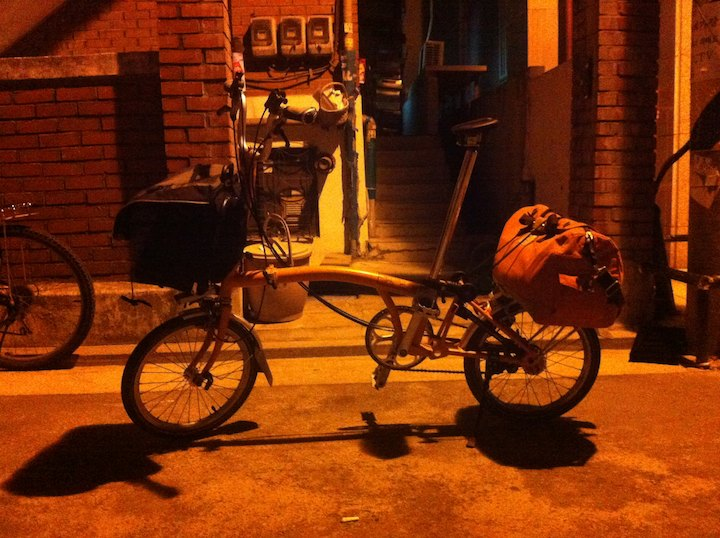

떠났던 곳으로 무사히 되돌아왔다.
