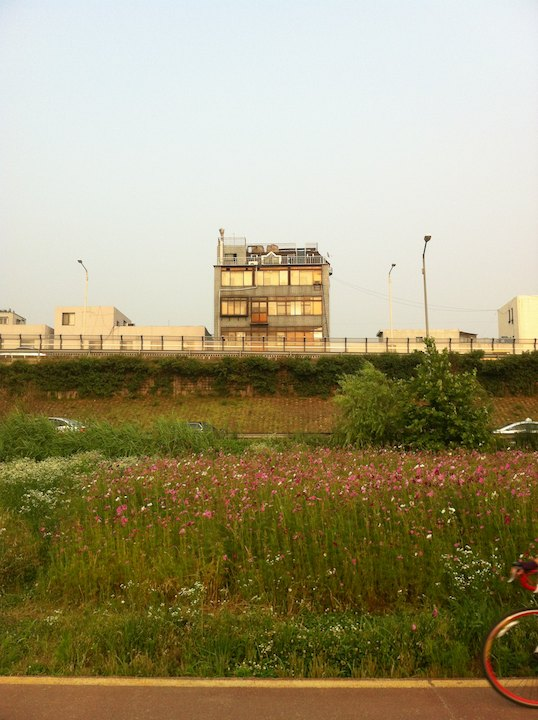
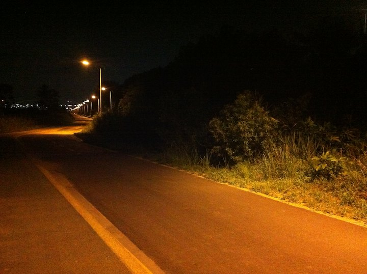
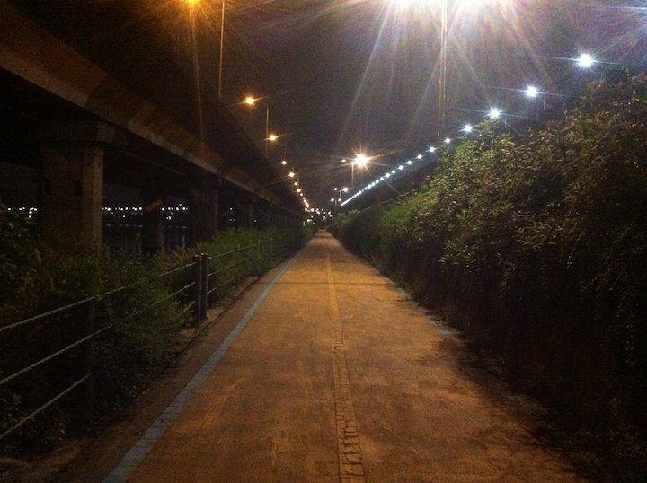
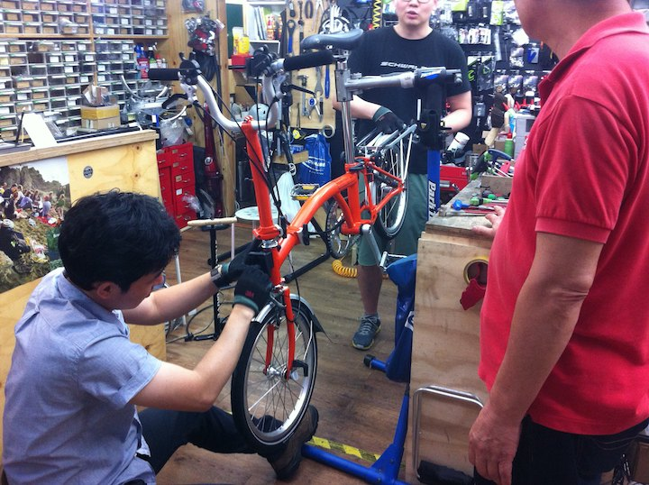
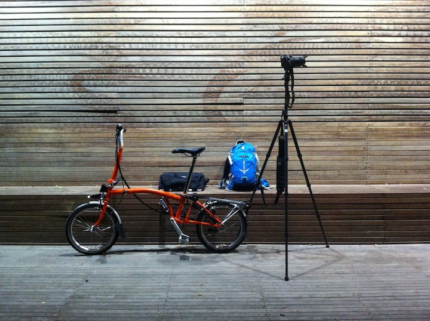
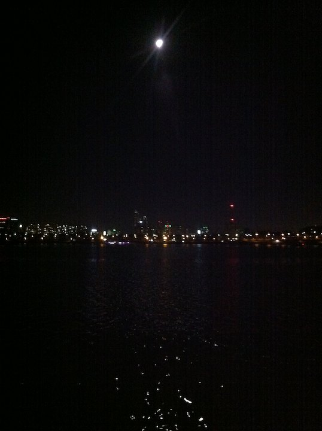
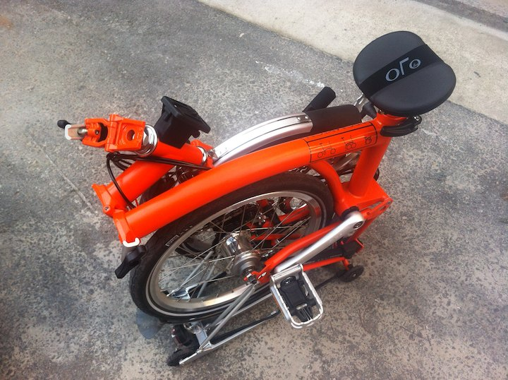
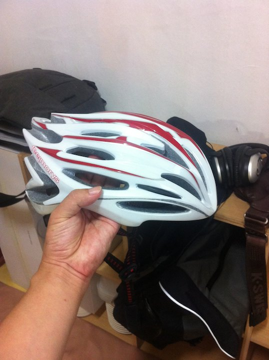
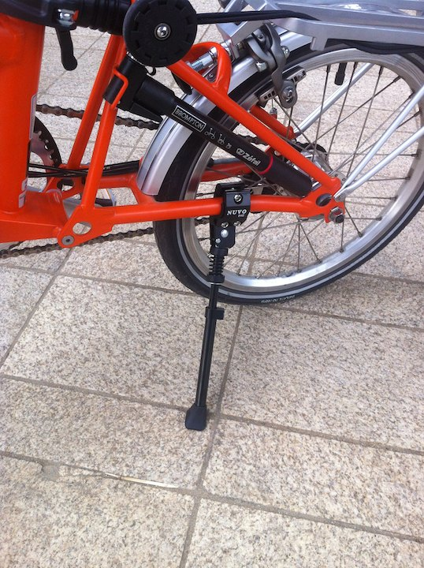
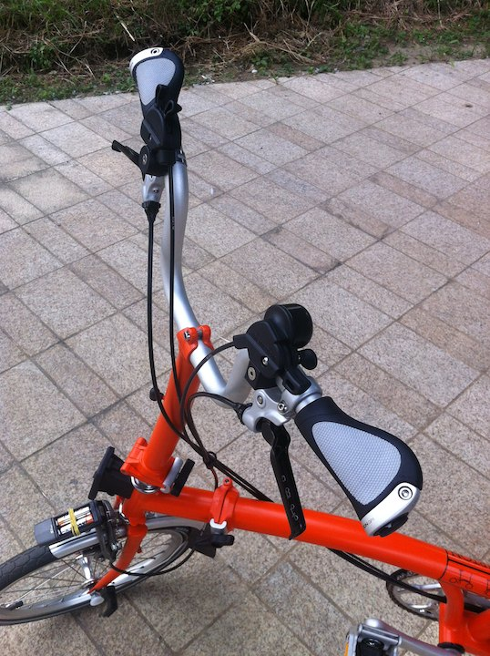

# 브롬톤

초등학교때 200 원에 한 시간씩 빌려주던 자전거로 타는 법을 배웠다.
첫 자가용은 공익근무요원 출퇴근용으로 샀던 5 만원짜리 중국산 자전거였다.
그후 20 년간 자전거와 나는 아무 관련이 없었다.

모든 일의 원인이 되는 사건이 발생했다. [화덕헌](https://twitter.com/duckhun1965) 님의 이 글이다. 
'[자전거 ... 브롬톤 타보신 분 있으세요?](http://www.raysoda.com/Com/Note/View.aspx?f=A&l=1000&v=S&t=932092)'

저 때만 해도 브롬톤은 신기한 사치품이었다. 나와 관계있을 법한 물건은 아니었다.

보라. 자전거와 라이더는 사진찍는데 방해만되는 것이다.

친구의 친구 [심호섭](https://twitter.com/hosup) 님이 있다.둘이 저녁 먹으러 양재천을 넘다가 우연히 자전거 얘기가 나왔다. 나는 내가 본 별나라 자전거, 이름을 외우는 유일한 자전거 브롬톤 이야기를 꺼냈다. 어라, 호섭님 자전거가 브롬톤이란다. 나와 상관없던 물건이 갑자기 매우 가깝게 느껴진다.

라이더들을 피해 야밤이나 새벽에 사진을 찍으러 다녔다.
위에 사진은 탄천인데 탄천은 생각보다 꽤 길다.
갑자기 끝까지 가보고 싶어졌다. 걸어가긴 어렵다.

건대집에서 자정에 출발하여 반포대교까지 걸어보았다. 6 시간 걸렸다.
자전거가 생각이 난다.

공부하기는 귀찮고 내가 이름을 아는 유일한 자전거를 한번 보러가기로 했다.

보러갔다가 다시 사러오는 것이 귀찮을 것 같아 그 자리에서 걍 샀다.

200 만원짜리 자전거다.
타보고 부담스러우면 몇 십 만원 손해보고 중고로 팔면된다.
아는 것이 없어 꼭 필요하다는 앞뒤 등, 이지휠, 카메라 던져 넣을 바구니를 달았다.

조립되고 있는 내 브롬톤. 담 날부터 풀 찍으러 다닐 것을 알 기에 풀 사이에서도 눈에 확 띨 수 있는 주황색을 골랐다.

사자마자 달려보았다. 서쪽으로 서쪽으로. 가다가 조명이 되는 곳이 있어서 한 컷.

자가용이 생겼으니 이제 이런 밤하늘 보러 자주 나올 수 있다.

사자마자 5 시간 넘게 탔더니 다음 날 회음부 통증이 장난 아니다.
회음부 압박이 사라진다고 하여 바로 오토리 안장을 달았다. 안장 코가 없다.

대두에 옆짱구라 머리 들어가는 모자 구하는 것만도 힘들었다.

브롬톤은 세우려면 뒷바퀴를 접어야 한다. 사진 찍을 때마다 세우는 것이 불편하여 누보 스탠드 장착.
누보는 잘 돌아가서 자전거가 넘어져버리니 세울 때 항상 주의해야 한다.

핸들을 오래 잡고 있으면 손바닥이 꽤 아프다. 손바닥과 닿는 면적을 넓혀 통증을 줄여준다는 에르곤 그립을 달았다.
급한대로 통중 줄여주는 부품들만 투입했다.

브롬톤은 앞에 여러 종류의 가방을 달 수 있는데 그중 첫날 산 바구니와 이후 여행기에 등장할 C 백이 있다.
따로 사진을 찍어 놓지 않았는데 C 백은 앞으로 주구 장창 보시리라. 수납공간이 커서 여행에 아주 도움이 되었다.

뒤에도 가방을 달 수 있다. 정품 뒷 가방은 품절이라 일반쌕을 달고 다니려고 했는데 마침 깔맞춤 되는 가방을 집앞에서 하나 샀다. 이것도 앞으로 여행기에서 매일 보시리라.

브롬톤은 폈을 때도 이뿌고, 접었을 때도 이뻐서 지나가는 모든 이의 시선을 끌고, 무지 느리고, 무지 무겁고, 무지 비싸고, 바퀴는 작은데 많은 물건을 실을 수 있고, 항상 내 옆에 휴대할 수 있는 자전거다. 아직도 나는 이 자전거 밖에 모른다.
