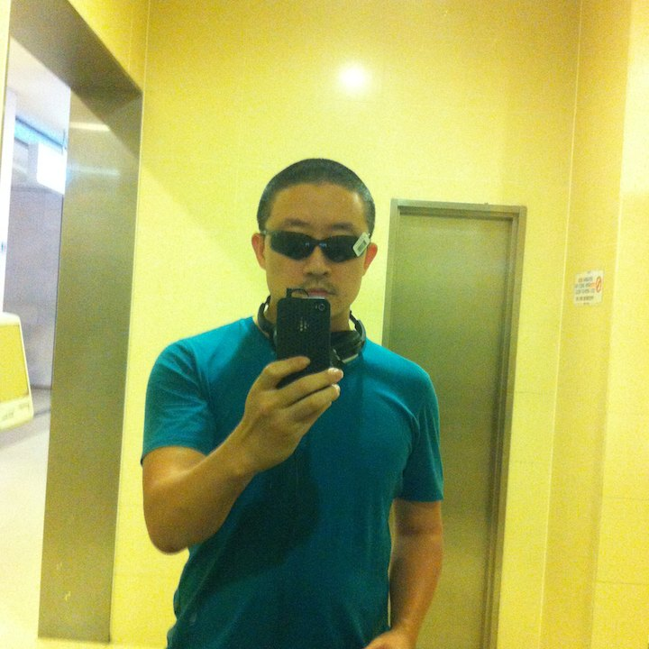
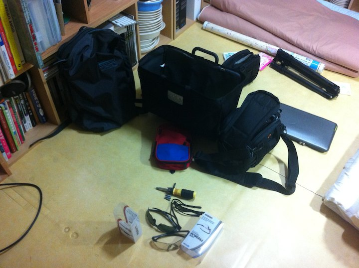
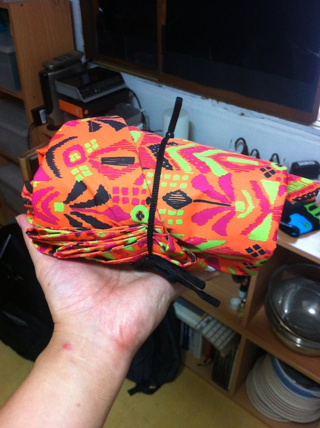
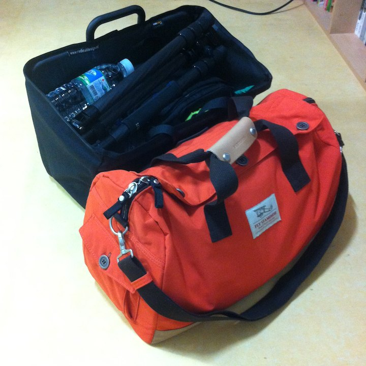

# 여행준비

입밖으로 꺼내진 않았지만 담 날부터 내가 뭘 미친듯이 준비했는지는 확실했다.

자전거 손잡이를 바꾸고, 퀵스텐드를 붙였다. 스페어 튜브, 패치, 스패너, 목장갑도 샀다. 크록스만 신다가 만 년만에 운동화도 샀다. 며칠 만에 일 년치 생활비를 쓴 것 같다.

여행기 보면 튜브 패치 사가지고 가란 말은 꼭 있는데 엉덩 패치 사가라는 말은 별로 없더라. 대일밴드 넓쩍한 것 가져가서 유용히 썼다.

라이더들이 입는 쫄바지, 걍 쫄쫄이 기능만 있는 줄 알았는데 그 안에 패드가 달려있다니! 패드 반바지도 하나 샀다.
매일 빨고 달리면서 말리면 되니까 여행 내내 바지 한벌로 다녔는데 아침엔 계속 눅눅해서 사타구니 건강유지에는 나쁜 것 같다. 담엔 두 벌 가져가는 것이 좋겠다 싶다.

이마트서 산 만원짜리 글라스. 모양은 얼핏 30 만원짜리와 비슷하나 난반사가 심해 세계가 세개로 보였다. 버렸다.

이 가방에 싸봤다가 저 가방에 싸봤다가 난리; 결국 새 주황색 가방 하나 투입했다. 앞으로 계속 등장한다.

종이지도 큰 거 샀다가 걍 버렸다. 폰에 네이버 지도 꼭 넣고 가시라.
다음 맵 매니아도 자전거 옵션 때문에 네이버 지도 써야한다.
남한강길이니 새재길까지는 한 가닥이라 화살표만 따라가면 되는데 낙동강길은 갈래가 계속 생기고 표지판 확인하기 어려운 곳도 많다. 네이버 지도 없으면 우주 미아가 될 것이다.

비가와도 달릴 생각으로 판쵸도 샀다.
판쵸입고 비오는 날도 달리긴 했는데 빗발이 심해지면 도로가 물궁댕이가 되서 역시 무리다.
가벼운 비 면하기는 좋다. 손잡이까지 다 덮고 달리면 된다. 

자정을 막 넘어 출발일이 되었다. 물건은 잔뜩 사들이고 이것 저것 테스트는 마쳤는데 진작 가방은 하나도 못 쌌고 일정이나 지도, 숙박 확인도 못 했다. 

여행 코스 확인하다 보니 새벽 2 시다. 국수역에서 충주까지 100 킬로, 이게 계획의 전부다. 더 볼 시간이 없다. 가면서 확인하자. 짐 싸기는 시작도 못했다.

한 시간 만에 두 가방 세팅 완료.
사진 처럼 앞 가방으로 바구니를 쓰려고 했는데 집에서 나오려던 찰나 C백으로 바꿨다. 잘 한 선택이었다.
C백이 들고 다니기가 훨씬 수월하고 수납도 좋았다.
아주 유용하게 섰다.
모양은 S백이 살짝 작고 이쁜데 가격이 후덜덜하여 두 개 다 사용해보진 못했다. 

이제 해뜨면 출발이다.
